# KVM
This documentation describes the detailed procedure to configure an automated test at the boot of the virtual machine. The system allows forcing the boot with a specific kernel via GRUB and running `cyclictest` automatically for a single session of 5 minutes, disabling the automation once completed.

## 1. Implementation of the Control and Test Script

The Bash script invokes `cyclictest` for a 5-minute duration, redirects the results to a log file, and disables the service upon completion to prevent execution on subsequent normal boots.

### Step 1.1: Script creation
Create a new executable file in the system path dedicated to local scripts:

```bash
sudo nano /usr/local/bin/run_cyclictest.sh
```

### Step 1.2: Script code (`run_cyclictest.sh`)
Paste the following code inside the file:

```bash
#!/bin/bash

# Paths configuration
LOG_DIR="/var/log/cyclictest_results"

# Ensure the log directory exists
mkdir -p "$LOG_DIR"

# Wait for system to fully settle before starting the test
sleep 30

# Execute cyclictest with Real-Time priority for 5 minutes
sudo cyclictest --mlockall --priority=99 --threads=1 --affinity=1 --interval=50 --duration 5m -H 1000 --histfile="$LOG_DIR/results_hist.log"

# Termination condition: remove the service to prevent running on future reboots
systemctl disable cyclictest-autorun.service
```

### Step 1.3: Assign execution permissions
Configure the correct POSIX permissions to allow systemd to invoke the script:

```bash
sudo chmod +x /usr/local/bin/run_cyclictest.sh
```

---

## 2. Configuration of the Systemd Unit Service

To ensure the script is executed immediately after the boot phase and in a non-interactive context, a `oneshot` type systemd service is implemented.

### Step 2.1: Unit file creation
Create the service descriptor within the system units directory:

```bash
sudo nano /etc/systemd/system/cyclictest-autorun.service
```

### Step 2.2: Service structure (`cyclictest-autorun.service`)
Configure the unit with the following directives:

```ini
[Unit]
Description=Cyclictest Automation 5-Min Run
After=network.target

[Service]
Type=oneshot
ExecStart=/usr/local/bin/run_cyclictest.sh
RemainAfterExit=yes

[Install]
WantedBy=multi-user.target
```

---

## 3. Enabling and Executing the Flow

Once the components are defined, it is necessary to notify the service manager of the changes and enable the automatic startup of the test.

### Step 3.1: Reload the systemd daemon
```bash
sudo systemctl daemon-reload
```

### Step 3.2: Enable the service at boot
```bash
sudo systemctl enable cyclictest-autorun.service
```

### Step 3.3: Triggering the test
To start the automated 5-minute test, perform a manual reboot of the KVM virtual machine:

```bash
sudo reboot
```

After the system boots, it will wait 30 seconds and then run the test for exactly 5 minutes. At the end of the process, the results will be available in `/var/log/cyclictest_results/results_hist.log`, the service will automatically disable itself, and the system will remain stably booted on the set kernel.

## BASELINE PERFORMANCE ANALYSIS IN KVM ENVIRONMENTS

This section presents a detailed analysis of execution latencies measured within a virtualized environment based on the Kernel-based Virtual Machine (KVM) hypervisor. The primary objective is to establish a performance baseline and evaluate the system's behavior, determinism, and virtualization overhead under standard scheduling policies before introducing more advanced or restrictive tuning configurations.

To quantify response times, internal jitter, and the Worst-Case Execution Time (WCET), the `cyclictest` tool was employed through continuous 5-minute baseline executions. The investigation explores the impact on system stability and temporal predictability by cross-referencing four distinct kernel combinations between the underlying Host infrastructure and the Guest virtual machine:

* **Non-Real-Time (NRT) Host and Non-Real-Time (NRT) Guest:** to measure standard system behavior and baseline virtualization overhead in the total absence of real-time optimizations.
* **Non-Real-Time (NRT) Host and Real-Time (RT) Guest:** to evaluate the effectiveness of internal scheduling optimizations within the guest when the underlying hypervisor lacks deterministic guarantees.
* **Real-Time (RT) Host and Non-Real-Time (NRT) Guest:** to analyze the impact of a determinism-optimized host on the performance, preemption spikes, and overall execution stability of a standard, general-purpose guest.
* **Real-Time (RT) Host and Real-Time (RT) Guest (Full RT Stack):** to observe the maximum level of temporal predictability achievable by aligning both the host infrastructure and the guest operating system with the `PREEMPT_RT` patch.

The analyses in the following paragraphs offer a comprehensive overview of the latency profiles characteristic of each configuration, detailing the limitations of general-purpose environments and validating the effectiveness of an end-to-end real-time stack for mitigating virtualization overhead.

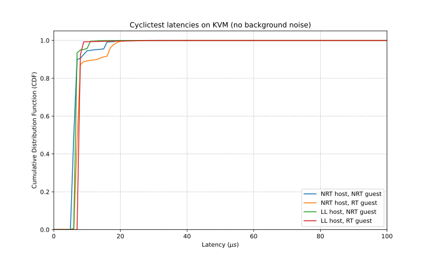

## NON-REAL-TIME HOST AND NON-REAL-TIME GUEST

This section presents an analysis of a single, extended 5-minute `cyclictest` run conducted in a standard environment, featuring a Non-Real-Time guest Linux kernel hosted on a Non-Real-Time host system. The objective is to establish a performance baseline and assess system determinism in the absence of real-time optimizations, such as the `PREEMPT_RT` patch or a real-time tuned host hypervisor.

### Distribution Analysis and Nominal Performance
Analysis of the histogram log reveals significant consistency during nominal execution over the 5-minute test period. The statistical mode (the most frequent latency value) was anchored firmly at 6 µs. The average latency was equally stable, measuring exactly 7 µs across the entire continuous execution. Additionally, the minimum recorded latency was extremely low, bottoming out at 5 µs. This performance indicates that under nominal conditions, without background load or anomalous preemption, the baseline overhead introduced by the default virtualization layer and host kernel scheduler is remarkably low.

### Worst-Case Execution Time (WCET) and Lack of Determinism
The fundamental limitation of this general-purpose configuration is revealed by the Worst-Case Execution Time (WCET) data, which continues to demonstrate high variability and unpredictable latency spikes. Across the 5-minute continuous execution, the absolute maximum latency recorded was 602 µs, a severe, stochastic deviation from the average.

### Conclusions on Standard Environments
These latency spikes—the "long tails" observed in the distribution logs—are characteristic of general-purpose software stacks. In this ecosystem, the hypervisor operates without strict real-time constraints and may preempt the Virtual CPU (VCPU) to serve host-level tasks; simultaneously, the guest kernel is subject to non-preemptible critical sections and non-deferrable hardware interrupts. Consequently, while nominal and average performance metrics are excellent, the Non-RT guest on a Non-RT host environment is susceptible to unpredictable delays and cannot guarantee the rigid, reliable upper bounds required for safety-critical control applications.

## NON-REAL-TIME HOST AND REAL-TIME GUEST
This section analyzes the results obtained from a single, prolonged 5-minute execution of the `cyclictest` tool in a hybrid environment, configured with a Real-Time optimized guest hosted on a Standard Linux Kernel Host. The goal of this analysis is to evaluate if the guest's internal real-time scheduling can maintain determinism during sustained workloads when the underlying host hypervisor lacks real-time optimizations.

### Nominal Performance and Average Latency
The data collected confirm that optimization at the guest level guarantees excellent efficiency in the average case. The average latency value is extremely stable, resting at 8 µs for the duration of the 5-minute test. Furthermore, the absolute minimum latency dropped down to 4 µs. This behavior indicates that the host allocates VCPU resources to the guest promptly and with minimal virtualization overhead under normal operating conditions despite not being patched.

### Worst-Case Execution Time (WCET) Analysis
Despite the high baseline efficiency of the underlying infrastructure, the analysis of the Worst-Case Execution Time (WCET) reveals a severe lack of determinism under sustained testing. The recorded maximum latency reached an extreme peak of 6114 µs (over 6 milliseconds), and other 3 over-milliseconds spikes. This data indicates that while the system performs well nominally, it is subject to rare but catastrophic scheduling delays that shatter any real-time guarantees.

### Conclusions on the Hybrid Environment
The empirical observation of this sustained 5-minute test demonstrates conclusively that the exclusive optimization of the virtualization infrastructure (Hypervisor/Host) is not able to stem anomalous latencies if the guest operating system is not equally optimized. The critical peak of over 6 milliseconds is a direct symptom of the internal architecture of the standard kernel. The absence of the `PREEMPT_RT` patch leaves the guest vulnerable to delays induced by the host's non-preemptible critical sections (such as spinlocks), non-deferrable hardware interrupts, and unbounded priority inversion phenomena.

Therefore, to obtain reliable determinism in control contexts, the use of an RT Guest proves not to be a sufficient condition.

## REAL-TIME HOST AND NON-REAL-TIME GUEST
This section analyzes the results obtained from a single, prolonged 5-minute execution of the `cyclictest` tool in a hybrid environment, configured with a  Standard Linux Guest hosted on a Real-Time `PREEMPT_RT` patched Host. The goal of this analysis is to verify whether the use of a deterministic Host hypervisor is sufficient to guarantee strict temporal constraints during sustained workloads when the guest operating system remains general-purpose.

### Nominal Performance and Average Latency
The data collected confirm that optimization at the Guest OS level guarantees excellent efficiency in the average case. The average latency value is extremely stable, resting at 8 µs for the duration of the 5-minute test. Furthermore, the absolute minimum latency dropped down to 4 µs. This behavior indicates that the Real-Time guest handles thread scheduling promptly and with minimal overhead under normal operating conditions.

### Worst-Case Execution Time (WCET) Analysis
The analysis of the Worst-Case Execution Time (WCET) reveals highly stable and deterministic behavior during this sustained test. The absolute maximum latency recorded reached a peak of only 93 µs. This data demonstrates a complete absence of the severe, prolonged hypervisor-induced preemption spikes that typically characterize standard host environments.

### Conclusions on the Hybrid Environment
The empirical observation of this sustained 5-minute test demonstrates conclusively that the exclusive optimization of the guest operating system is not able to stem anomalous latencies if the virtualization infrastructure (Hypervisor/Host) is not equally optimized. The critical peak of over 6 milliseconds is a direct symptom of the internal architecture of the standard host kernel. The absence of the `PREEMPT_RT` patch on the host leaves the guest vulnerable to delays induced by the host's non-preemptible critical sections (such as spinlocks), non-deferrable hardware interrupts, and unbounded priority inversion phenomena.

## REAL-TIME HOST AND REAL-TIME GUEST (FULL RT STACK)

This section analyzes the results obtained from a single, prolonged 5-minute execution of the `cyclictest` tool in a "Full RT" environment, where a `PREEMPT_RT` patched Linux guest kernel is hosted on a Real-Time optimized Host. The objective of this configuration is to validate the effectiveness of an end-to-end real-time stack in mitigating virtualization overhead and establishing a strict, deterministic upper bound for execution latency during a sustained workload.

### Nominal Performance and Average Latency
The experimental data collected demonstrates unparalleled stability under sustained nominal conditions. The average latency metric is exceptionally consistent, locked at 8 µs for the duration of the test. The absolute minimum latency recorded was 7 µs. The histogram distribution highlights this extreme efficiency, showing that the vast majority of execution cycles—over 92% of samples—completed in exactly 8 µs. This indicates that when the Virtual CPU (VCPU) is active, the `PREEMPT_RT` patch successfully manages thread scheduling and interrupt handling with virtually zero internal jitter, effectively mirroring bare-metal performance for standard task cycles.

### Worst-Case Execution Time (WCET) Analysis
The transition to a Full RT stack demonstrates a definitive improvement in worst-case performance, completely neutralizing the severe stochastic latency spikes observed in non-optimized configurations. Throughout the entire 5-minute sustained test, the absolute maximum latency (Worst-Case Execution Time) was strictly bounded at just 81 µs. The "long tail" of the distribution—characteristic of hypervisor-induced preemption and unoptimized kernel locks—has been entirely eliminated. The system demonstrates a robust, flawless ability to remain within deterministic bounds, drastically reducing the magnitude of any scheduling delays.

### Conclusions on the Full RT Architecture
The empirical observation of this sustained test provides conclusive evidence regarding the requirements for deterministic virtualization:

*   **End-to-End Determinism:** Achieving hard real-time guarantees is an end-to-end property, and the combination of the `PREEMPT_RT` Guest kernel and a Real-Time Host successfully prevents hypervisor-induced preemption.
*   **Absolute Stability:** The system maintained a strict upper bound of 81 µs over nearly 6 million consecutive execution cycles.
*   **Zero Overflows:** The complete absence of histogram overflows confirms that the system never experienced uncontrolled latency spikes during the prolonged execution.
*   **Viability for Critical Systems:** This "Full RT" configuration establishes a highly predictable WCET, proving that with proper infrastructure tuning, virtualized environments can reliably support safety-critical control applications that previously required dedicated bare-metal hardware.

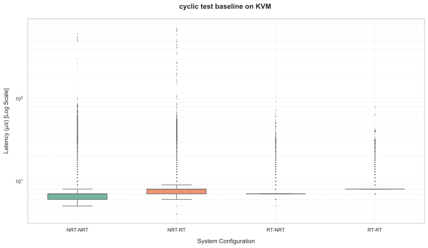

## Impact of the Stress Workload on Latencies

To evaluate system robustness and trigger potentially higher latencies, the testing methodology involves introducing an additional load, defined as a "stress workload." In the case of the KVM hypervisor, this stress workload is executed in the background directly on the Host operating system, simulating heavy external contention that competes for CPU time and system resources.

Experimental analysis of the KVM infrastructure reveals that adding this background load produces severe performance degradation across the board. Unlike the complex, configuration-dependent behaviors observed in other hypervisors, the stress workload on KVM exposes fundamental architectural vulnerabilities in maintaining determinism:

* **Catastrophic Failure in Unoptimized and Hybrid Stacks:** Introducing host-level stress immediately shatters the determinism of standard and hybrid configurations. Whether using a fully Non-Real-Time (NRT) stack or attempting partial optimization (an RT Guest on an NRT Host, or an NRT Guest on an RT Host), the system experiences catastrophic scheduling delays. Maximum latencies in these configurations routinely spike between 44 and 51 milliseconds, indicating massive host-induced starvation and lock contention.
* **The Illusion of Guest-Only Optimization:** Counter-intuitively, equipping the Guest with a Real-Time kernel while the Host remains NRT yielded the highest variability and the worst absolute latency spikes (over 51 milliseconds) of the dataset. This proves that an optimized guest scheduler is entirely powerless to protect time-sensitive threads if the underlying Host hypervisor is vulnerable to non-deterministic preemption.
* **Chronic Instability of the Full RT Stack:** Even when utilizing an end-to-end "Full RT" stack (RT Host and RT Guest) with optimal prioritization parameters, the KVM environment fails to guarantee strict real-time bounds under stress. While the Full RT stack successfully suppresses the catastrophic 50-millisecond delays (bounding the absolute maximum latency to approximately 9.8 milliseconds), it suffers from a massive frequency of significant scheduling stalls, evidenced by hundreds of over-millisecond latency overflows.

In this section, we will present the detailed experiments conducted under these stress conditions and analyze the resulting execution logs.

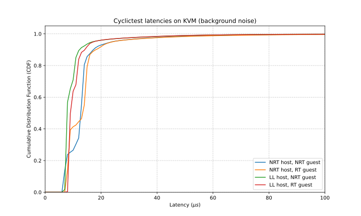

## NON REAL-TIME HOST AND NON REAL-TIME GUEST -STRESS HOST

This section presents an analysis of the first `cyclictest` execution log conducted on a KVM host under stress conditions. The objective is to evaluate the system's scheduling behavior and latency bounds when subjected to external load.

### Distribution Analysis and Nominal Performance
Analysis of the histogram log reveals that the system maintains a reasonable baseline under stress. Over the test duration, the average latency recorded was 13 µs. The statistical mode (the most frequent latency) was concentrated at 14 µs, with a significant number of cycles also completing at 13 µs. The absolute minimum recorded latency dropped to an impressive 5 µs. This indicates that when the CPU is not actively dealing with stress-induced contention, the base virtualization and scheduling overhead remains low.

### Worst-Case Execution Time (WCET) and Lack of Determinism
The impact of the stress workload becomes severely apparent when analyzing the Worst-Case Execution Time (WCET). The absolute maximum latency recorded during this run was an extreme 44,409 µs (over 44 milliseconds). Furthermore, the log reports 11 histogram overflows (latencies exceeding the 1000 µs tracking threshold). 

### Conclusions
The presence of 44-millisecond latency spikes clearly demonstrates that this environment lacks determinism. Under stress, the host OS experiences massive scheduling delays, likely due to lock contention, non-preemptible critical sections, or starvation of the test threads. This configuration cannot guarantee the strict upper bounds required for real-time applications.

## NON REAL-TIME HOST AND REAL-TIME GUEST -STRESS HOST

This section analyzes the results obtained from the second `cyclictest` execution, also run under stressed conditions on the KVM host infrastructure. 

### Nominal Performance and Average Latency
The nominal performance mirrors the first log closely, confirming a consistent baseline efficiency even under load. The average latency was precisely 13 µs, and the minimum latency was 5 µs. Interestingly, the distribution shows a dual-peak behavior, with the highest concentration at 13 µs (the mode), but with another massive spike of cycles completing at 7 µs.

### Worst-Case Execution Time (WCET) Analysis
This specific execution experienced the highest variability and worst latency spikes of the entire dataset. The absolute maximum latency reached an exorbitant 51,069 µs (over 51 milliseconds). The severity of the instability is further highlighted by the 26 histogram overflows, more than double the number seen in the first log. 

### Conclusions 
The empirical observation of this run conclusively shows that the stress workload induces chaotic, non-deterministic preemption. A 51-millisecond delay represents a catastrophic failure for any safety-critical system. The KVM host in this state is entirely unsuitable for bounded real-time execution, as the scheduler cannot adequately protect time-sensitive threads from background stress.

## REAL-TIME HOST AND NON REAL-TIME GUEST -STRESS HOST

This section examines the third prolonged execution of the `cyclictest` tool on the stressed KVM host environment, validating the patterns observed in previous iterations.

### Nominal Performance and Average Latency
The data collected confirms a stable nominal execution path. The average latency metric remained locked at 13 µs, while the minimum latency reached the lowest point among the first three runs, hitting 3 µs. The histogram shows a massive concentration of execution cycles completing in exactly 13 µs, indicating that when the scheduler is unimpeded, it processes tasks with high consistency.

### Worst-Case Execution Time (WCET) Analysis
Despite the strong nominal performance, the WCET remains unacceptable for real-time standards. The maximum latency peaked at 50,257 µs (over 50 milliseconds). The system registered 11 histogram overflows, indicating multiple occurrences of severe scheduling stalls exceeding one millisecond.

### Conclusions
This run confirms that while the system can occasionally achieve extremely fast task dispatching (3 µs min), it is completely vulnerable to unpredictable, systemic delays. The 50-millisecond peak re-emphasizes that background stress can effectively starve tasks for dozens of milliseconds, a fatal condition for latency-sensitive applications.

## REAL-TIME HOST AND REAL-TIME GUEST -STRESS HOST

This section presents an analysis of the provided `cyclictest` execution log conducted on a KVM environment under stress conditions. The objective is to evaluate the system's scheduling determinism and latency bounds when subjected to external load.

### Distribution Analysis and Nominal Performance
Analysis of the histogram log reveals a highly efficient baseline performance under nominal execution. The statistical mode (the most frequent latency) is sharply concentrated at 7 µs, representing over 1.7 million completed cycles. The average latency metric is remarkably stable at 11 µs, and the absolute minimum recorded latency is exceptionally low at 4 µs. This indicates that most of the time, the virtualization overhead is minimal.

### Worst-Case Execution Time (WCET) Analysis
Despite the excellent average case, the analysis of the Worst-Case Execution Time (WCET) reveals severe scheduling instability induced by the stress workload. The absolute maximum latency recorded reached 9,829 µs (nearly 9.8 milliseconds). Even more critically, the log reports an overwhelming 283 histogram overflows (latencies exceeding the 1000 µs tracking threshold). This represents a massive frequency of significant scheduling stalls compared to typical runs.

### Conclusions
The empirical observation of this execution demonstrates severe latency instability, which is particularly critical given the system's strict configuration. Despite this optimal prioritization, the system still suffered from chronic and significant delays.

These high latencies indicate that the delays are originating from deeper, non-preemptible sources escaping the guest's control. Consequently, this configuration proves that merely applying the maximum scheduler priority is fundamentally insufficient to guarantee the strict, reliable upper bounds required for safety-critical real-time applications.

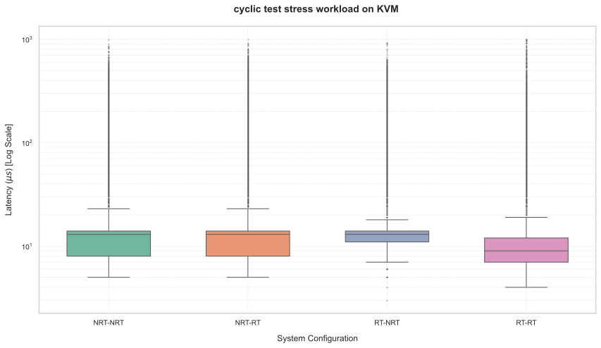

## ISOLATED STRESS HOST PERFORMANCE ANALYSIS

This section presents a detailed analysis of execution latencies measured within a virtualized environment based on the Kernel-based Virtual Machine (KVM) hypervisor, subjected to a background stress workload but utilizing OS-level isolation strategies. The primary objective is to evaluate whether spatial isolation of the Virtual CPUs (VCPUs) can effectively shield the guest operating system from the severe preemption and scheduling delays induced by host-level contention.

To quantify response times, internal jitter, and the Worst-Case Execution Time (WCET) under these isolated conditions, the `cyclictest` tool was employed through continuous 5-minute executions. The investigation explores the impact on system stability and temporal predictability by cross-referencing four distinct kernel combinations between the underlying Host infrastructure and the Guest virtual machine:

* **Non-Real-Time (NRT) Host and Non-Real-Time (NRT) Guest:** to measure system behavior and virtualization overhead when applying isolation techniques to a standard, unoptimized software stack.
* **Non-Real-Time (NRT) Host and Real-Time (RT) Guest:** to evaluate the effectiveness of an optimized guest scheduler operating on dedicated cores, while the underlying hypervisor lacks deterministic guarantees.
* **Real-Time (RT) Host and Non-Real-Time (NRT) Guest:** to analyze the impact of a determinism-optimized host on the preemption spikes of a standard guest when spatial isolation is enforced.
* **Real-Time (RT) Host and Real-Time (RT) Guest (Full RT Stack):** to observe the maximum level of temporal predictability achievable by combining CPU isolation with an end-to-end `PREEMPT_RT` patched infrastructure.

The analyses in the following paragraphs offer a comprehensive overview of the latency profiles characteristic of each isolated configuration, detailing the effectiveness of core pinning in mitigating the catastrophic failures observed in un-isolated stress scenarios.

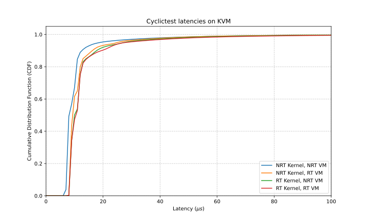

## NON-REAL-TIME HOST AND NON-REAL-TIME GUEST (ISOLATED STRESS HOST)

This section presents an analysis of a single, extended 5-minute `cyclictest` run conducted in an isolated environment, featuring a Non-Real-Time guest Linux kernel hosted on a Non-Real-Time host system under stress. The objective is to establish a performance baseline for spatial isolation without real-time kernel patches.

### Distribution Analysis and Nominal Performance

Analysis of the histogram log reveals a very consistent nominal execution under isolated stress. The statistical mode (the most frequent latency value) was anchored firmly at 8 µs. The average latency was highly stable, measuring exactly 11 µs across the entire continuous execution. Additionally, the minimum recorded latency dropped to 6 µs. This indicates that CPU isolation successfully protects the active VCPU during standard execution cycles, keeping the baseline virtualization overhead low despite the background load on the host.

### Worst-Case Execution Time (WCET) and Lack of Determinism

While isolation drastically improved the overall stability compared to un-isolated stress tests (which saw 44-millisecond delays), the Worst-Case Execution Time (WCET) data reveals that determinism is not fully guaranteed. The absolute maximum latency recorded was bounded at 2,024 µs (roughly 2 milliseconds). However, the system still registered 19 histogram overflows (latencies exceeding the 1000 µs threshold).

### Conclusions on Standard Isolated Environments

The application of CPU isolation prevents the catastrophic multi-millisecond starvation seen in standard stress scenarios, reducing the WCET by over 95%. However, the presence of nearly 2-millisecond spikes and 19 overflows confirms that a general-purpose NRT/NRT stack remains susceptible to unpredictable delays. Because the tasks cannot be preempted by standard user-space processes (due to the FIFO=99 scheduling policy), these spikes originate from deeper, non-preemptible sources such as host kernel lockups, unmaskable hardware interrupts, or shared hardware resource contention (like cache and memory bus) induced by the stress load running on neighboring cores.

## NON-REAL-TIME HOST AND REAL-TIME GUEST (ISOLATED STRESS HOST)

This section analyzes the results obtained from a single, prolonged 5-minute execution of the `cyclictest` tool in a hybrid environment, configured with a Real-Time optimized guest hosted on a Standard Linux Kernel Host, with CPU isolation applied during host stress.

### Nominal Performance and Average Latency

The data collected confirms that the isolated RT guest achieves excellent baseline efficiency. The average latency value rested at 12 µs, with the statistical mode concentrated at 9 µs. Furthermore, the absolute minimum latency reached an impressive 4 µs, indicating that the optimized guest scheduler, when isolated, dispatches tasks with extreme speed under nominal conditions.

### Worst-Case Execution Time (WCET) Analysis

The analysis of the Worst-Case Execution Time (WCET) reveals a massive improvement over the un-isolated equivalent (which previously failed catastrophically with 51-millisecond delays). With isolation, the absolute maximum latency recorded was capped at 2,299 µs. However, the system still experienced 11 histogram overflows over the 1-millisecond threshold.

### Conclusions on the Hybrid Isolated Environment

The empirical observation of this test demonstrates that isolating the VCPUs successfully shields the RT Guest from the chaotic preemption of the NRT Host's stress workload. Yet, the 2.3-millisecond peak and the 11 overflows indicate a lack of strict determinism. Since the internal guest tasks are running at maximum real-time priority, the remaining latency spikes must be attributed to the NRT host infrastructure. The underlying standard hypervisor still introduces non-deferrable interrupts or unpredictable virtualization overhead that occasionally stalls the isolated cores, proving that guest-side optimization alone is insufficient.

## REAL-TIME HOST AND NON-REAL-TIME GUEST (ISOLATED STRESS HOST)

This section examines the prolonged execution of the `cyclictest` tool in a hybrid environment featuring a Standard Linux Guest hosted on a Real-Time `PREEMPT_RT` patched Host, operating under isolated stress conditions.

### Nominal Performance and Average Latency

The nominal performance metrics indicate a highly stable execution path. The average latency metric was maintained at 13 µs, and the statistical mode was heavily concentrated at 9 µs. The absolute minimum latency recorded was 6 µs. This confirms that the RT Host efficiently manages the isolated VCPUs, providing a steady execution foundation.

### Worst-Case Execution Time (WCET) Analysis

The Worst-Case Execution Time (WCET) analysis shows the lowest peak latency among the hybrid configurations. The absolute maximum latency recorded reached 1,502 µs (approximately 1.5 milliseconds). Despite this tighter upper bound, the system still accumulated 16 histogram overflows during the 5-minute sustained test.

### Conclusions on the Hybrid Isolated Environment

Optimizing the Host OS with a `PREEMPT_RT` kernel, combined with CPU isolation, yielded a highly robust infrastructure that successfully limited the maximum delay to 1.5 milliseconds under heavy stress. However, the 16 recorded overflows demonstrate that the NRT Guest remains a bottleneck. Unoptimized internal locks and non-preemptible critical sections within the general-purpose guest kernel still generate periodic stalls, preventing the system from achieving hard real-time determinism despite the stable host infrastructure.

## REAL-TIME HOST AND REAL-TIME GUEST (FULL RT STACK - ISOLATED STRESS HOST)

This section analyzes the results obtained from the `cyclictest` execution in a "Full RT" environment, where a `PREEMPT_RT` patched Linux guest kernel is hosted on a Real-Time optimized Host, with spatial isolation applied during the stress workload. The objective is to evaluate the absolute limits of temporal predictability in a fully tuned KVM stack.

### Distribution Analysis and Nominal Performance

The experimental data highlights unparalleled efficiency in the best-case and nominal scenarios. The statistical mode was anchored at 9 µs, and the average latency was highly stable at 13 µs. Most notably, the absolute minimum latency recorded was an exceptional 3 µs—the lowest value observed across all configurations. This demonstrates that when the full RT stack operates unimpeded on isolated cores, the internal jitter and virtualization overhead are practically negligible.

### Worst-Case Execution Time (WCET) Analysis

Despite the optimal software stack and spatial isolation, the Worst-Case Execution Time (WCET) analysis reveals that strict hard real-time bounds are still compromised under stress. The absolute maximum latency was recorded at 1,935 µs (nearly 1.9 milliseconds), and the system experienced 14 histogram overflows over the 1000 µs tracking threshold.

### Conclusions on the Full RT Isolated Architecture

The empirical observation of this execution provides critical insight into the limits of virtualization determinism. Combining a Full RT stack with CPU isolation successfully mitigated the severe, multi-millisecond starvation caused by host stress, keeping the WCET under 2 milliseconds. However, the persistence of 14 overflows and a 1.9-millisecond peak proves that strict determinism is not perfectly guaranteed.

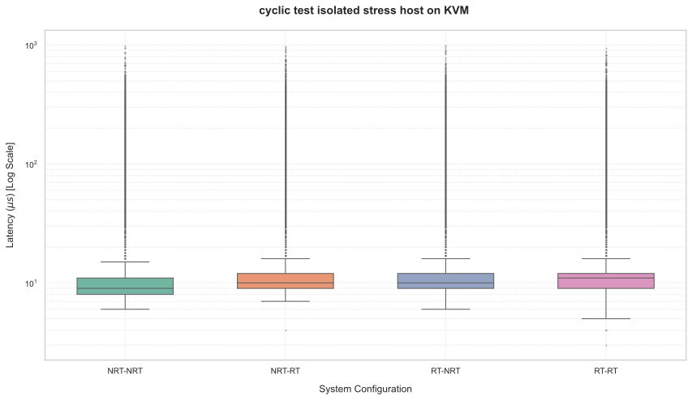

---

Following the detailed analysis of each individual scenario, the table below provides a consolidated overview of the Worst-Case Execution Time (WCET) measurements. It allows for a direct comparison across all four kernel configurations (**NRT-NRT**, **NRT-RT**, **RT-NRT**, and **RT-RT**) under the three tested conditions: standard execution (**BASELINE**), heavy system load in the control domain (**STRESS DOM0**), and load with isolation mechanisms applied (**STRESS DOM0 ISOLATED**).


| Configuration | NRT-NRT | NRT-RT | RT-NRT | RT-RT |
|---|---|---|---|---|
| **BASELINE** | 602 | 6114 | 93 | 81 |
| **STRESSHOST** | 44409 | 51069 | 50257 | 9829 |
| **STRESSHOST ISOLATED** | 2024 | 2299 | 1502 | 1935 |

Furthermore, alongside the WCET table, this section presents a detailed breakdown of the percentage increments for both the maximum latency (WCET) and the average latency (expressed as Mean $\pm$ Standard Deviation). This provides a precise quantitative analysis of the performance degradation induced by the stress workload compared to the baseline for each specific scenario.

### NRT NRT

| METRIC | BASELINE | STRESS WORKLOAD |
| :--- | :--- | :--- |
| **Average ± SD** | 7.10 ± 2.39 µs | 13.60 ± 11.18 µs |
| **WCET (Max)** | 602 µs | 44409 µs |

**PERCENTAGE INCREMENTS (Stress vs. Baseline):**
* Average Increment: +91.50%
* WCET Increment: +7276.91%


### NRT RT

| METRIC | BASELINE | STRESS WORKLOAD |
| :--- | :--- | :--- |
| **Average ± SD** | 8.55 ± 3.27 µs | 13.69 ± 12.00 µs |
| **WCET (Max)** | 6114 µs | 51069 µs |

**PERCENTAGE INCREMENTS (Stress vs. Baseline):**
* Average Increment: +60.10%
* WCET Increment: +735.28%


### RT NRT

| METRIC | BASELINE | STRESS WORKLOAD |
| :--- | :--- | :--- |
| **Average ± SD** | 7.22 ± 0.98 µs | 13.33 ± 8.54 µs |
| **WCET (Max)** | 93 µs | 50257 µs |

**PERCENTAGE INCREMENTS (Stress vs. Baseline):**
* Average Increment: +84.76%
* WCET Increment: +53939.78%


### RT RT

| METRIC | BASELINE | STRESS WORKLOAD |
| :--- | :--- | :--- |
| **Average ± SD** | 8.15 ± 1.15 µs | 11.84 ± 12.79 µs |
| **WCET (Max)** | 81 µs | 9829 µs |

**PERCENTAGE INCREMENTS (Stress vs. Baseline):**
* Average Increment: +45.20%
* WCET Increment: +12034.57%

## TACLe Benchmark

This section of the documentation illustrates the rationale behind the selection of the benchmarks extracted from the **TACLeBench** version 1.9 suite and the methodology adopted for their execution within our architecture. The goal is to provide a heterogeneous workload to accurately validate execution latencies and performance stability in environments with strict real-time requirements.

### 1. Benchmark Selection

We selected a representative program for each of the main TACLeBench categories, ensuring optimal coverage of the different execution patterns.

* **Kernel Benchmark (`matrix1`):** Isolates the most computationally intensive portions of code to evaluate raw CPU performance and cache efficiency.
* **Sequential Benchmark (`huff_enc`):** Evaluates sequential processing and memory access patterns. Data compression (325 SLOC, David Bourgin) is excellent for measuring latency variations in single-threaded execution.
* **Test Benchmark (`test3`):** An artificial stress test for WCET (Worst-Case Execution Time, 4235 SLOC, Universität des Saarlandes) analysis. It pushes the execution engine to its limits to measure time safety margins and system robustness.
* **Parallel Benchmark (`Debie`):** Aerospace observation tool (6615 SLOC, Tidorum Ltd) consisting of 8 tasks. Essential for testing synchronization mechanisms and preemption in multi-tasking scenarios.
* **Application Benchmark (`lift`):** An elevator controller (361 SLOC, Martin Schoeberl). Verifies that the latency metrics from synthetic tests guarantee stability in a real cyber-physical control application.

### 2. Execution Methodology and Test Scenarios

To rigorously analyze the system's behavior and the impact of the virtualization architecture, **all 5 selected benchmarks were executed on the RT-RT (Real Time Host, Real-Time Guest) configuration**.

For each benchmark, we defined a test matrix composed of four operational scenarios. In all configurations, **4 cores were dedicated to the Host**, and we prevented tasks to be scheduled on other cores by adopting some of the OS-level isolation techniques we already used: Tickless Mode, RCU callback offloading and IRQ affinity. Kernel scheduling isolation was not used because it interfered with the way KVM assigned virtual CPUs to phisical ones. The analyzed variables concern the introduction of a stress load (noise) of varying size originating from another Guest VM and the application of vCPU pinning (crucial for avoiding context migrations and stabilizing latencies).

To ensure strict real-time conditions and accurate latency measurements, the execution procedure was carefully standardized across all test scenarios. The process involved specific compilation flags, scheduler modifications, and rigid execution parameters designed to eliminate typical operating system interference.

**Compilation and Preparation**
Each of the benchmarks were modified to support automatically changing scheduling priority and repeated executions (the source code is available in this repository). We then compiled them using `-O2` optimizations and linked with the necessary POSIX real-time and threading libraries:

```bash
gcc -O2 -o test3 test3.c -lpthread -lrt

```

**Benchmark Execution Parameters**
The TACLe benchmarks were executed via the command line with a strict set of arguments to maintain deterministic behavior. The fundamental flags applied across the tests included:

* `--mlockall`: Locks the process's memory pages directly into RAM, preventing any unpredictable latency spikes caused by page faults or disk swapping.
* `--priority=99`: Enforces the highest real-time priority internally for the benchmark's execution thread.
* `--affinity=1`: Applies CPU pinning, locking the execution strictly to CPU core 1. This is a critical step to prevent costly context migrations across different processor cores.

Below are the exact execution commands utilized for the targeted benchmarks:

```bash
# Executing test3 (pseudo-cyclictest) for 10,000 loops and outputting a latency histogram
sudo ./test3 --mlockall --priority=99 --affinity=1 --loops=10000 --histogram=1000000 --histfile=results/results_test3_baseline.log
```

**Noise Generation Strategy**
To evaluate the architectural robustness and jitter expansion during the noisy scenarios, interference was artificially injected into the system. This was achieved using `stress-ng` to spawn multiple aggressive workers, intentionally taxing the CPU cores and the virtual memory subsystem to simulate severe cache thrashing and scheduling pressure:

```bash
stress-ng --cpu 16 --vm 16 --vm-bytes 1G --timeout 10m

```

**Virtual Machine Configuration**
To clearly understand the extent of the interference of a different Guest VM stress workload on the critical guest, we designed two test scenarios:

* **Small Noise**: a small Guest VM with just 2 vCPUs and 4 GB of RAM. This would introduce a small amount of noise, thus testing if at least some isolation is provided.
* **Big Noise**: a more beefy Guest VM configuration with 16 vCPUs and 16 GB of RAM. In this case, the interference introduced is more severe, pushing the limits of the isolation mechanism.
* **Big Noise with pinning**: the same of the previous setup but with added static vCPU pinning. This would determine how much the scheduling algorithm affects the isolation of the virtual machines.

### TACLeBench Baseline Execution Analysis 

Establishing this baseline is critical for evaluating the determinism and worst-case execution time (WCET) latencies of the KVM hypervisor. The following analysis interprets the raw execution logs to quantify the baseline scheduling determinism before the introduction of concurrent noisy guests.

#### Baseline Latency Summary

| Benchmark | Total Loops | Min Latency (μs) | Avg Latency (μs) | Max Latency (μs) | Absolute Jitter (Max - Min) |
| --- | --- | --- | --- | --- | --- |
| **DEBIE** | 10,000 | 23,578 | 27,214 | 32,409 | 8,831 μs |
| **huffenc** | 1,000,000 | 15 | 16 | 64 | 49 μs |
| **lift** | 1,000,000 | 19 | 19 | 61 | 42 μs |
| **matrix1** | 1,000,000 | 0 | 0 | 1 | 1 μs |
| **test3** | 10,000 | 8,169 | 8,363 | 9,471 | 1,302 μs |

#### Workload-Specific Behavior

**DEBIE**

* The DEBIE benchmark represents the heaviest parallel workload, executing 10,000 loops with execution times ranging from 23,578 µs to 32,409 µs.
* The absolute jitter sits at 8,831 µs, indicating typical baseline scheduling overhead and preemption for a heavy multi-tasking application on an unisolated KVM host.

**Huffenc**

* The `huffenc` benchmark executed 1,000,000 loops with an extremely stable average latency of 16 µs.
* The maximum latency peaked at 64 µs, resulting in an absolute jitter of 49 µs.

**Lift**

* The `lift` application benchmark showed strong determinism, maintaining an average latency of 19 µs matching its minimum latency.
* The worst-case latency was 61 µs, yielding a tightly bounded jitter of 42 µs on this KVM baseline.

**Matrix1**

* The `matrix1` kernel benchmark was extremely fast, executing 1,000,000 loops with sub-microsecond average latency.
* The maximum execution time was strictly capped at just 1 µs, demonstrating near-perfect cache efficiency and virtually zero jitter (1 µs).

**Test3**

* The `test3` benchmark executed 10,000 loops with an average latency of 8,363 µs.
* The maximum latency reached 9,471 µs, resulting in an absolute jitter of 1,302 µs, representing standard noise interference on a medium-weight computational loop.

#### Real-Time Systems Assessment

This KVM baseline provides the reference point for unisolated virtualized performance. Lightweight tasks (`matrix1`) exhibit virtually zero jitter (1 µs peak), while medium and heavy tasks (`test3`, `DEBIE`) show the natural variance introduced by the standard KVM scheduler (up to 8,831 µs of jitter for DEBIE). These metrics will be crucial for quantifying the exact determinism improvements when CPU pinning and LL-RT kernel isolation techniques are introduced.

### TACLeBench Small Noise Execution Analysis

This analysis evaluates the determinism and worst-case execution time (WCET) latencies of the KVM hypervisor under a "Small Noise" configuration. By introducing minor background system stress, we can quantify the sensitivity of the unisolated KVM scheduler to light interference.

#### Small Noise Latency Summary

| Benchmark | Total Loops | Min Latency (μs) | Avg Latency (μs) | Max Latency (μs) | Absolute Jitter (Max - Min) |
| --- | --- | --- | --- | --- | --- |
| **DEBIE** | 10,000 | 23,800 | 27,221 | 30,872 | 7,072 μs |
| **huffenc** | 1,000,000 | 15 | 15 | 61 | 46 μs |
| **lift** | 1,000,000 | 19 | 19 | 58 | 39 μs |
| **matrix1** | 1,000,000 | 0 | 0 | 0 | 0 μs |
| **test3** | 10,000 | 8,078 | 8,270 | 8,612 | 534 μs |

#### Workload-Specific Behavior

**DEBIE**

* The heavy parallel DEBIE workload experiences execution times ranging from 23,800 µs to 30,872 µs.
* The absolute jitter sits at 7,072 µs, showing that even small amounts of noise can cause significant preemption and scheduling variation for complex multi-tasking applications.

**Huffenc**

* The sequential `huffenc` task executes with an average latency of 15 µs and a maximum peak of 61 µs.
* This results in a relatively tight absolute jitter of 46 µs.

**Lift**

* The `lift` control benchmark maintains strong determinism under light noise, averaging 19 µs with a worst-case execution time of 58 µs.
* The resulting jitter is closely bounded at 39 µs, showing good resilience to minor disturbances.

**Matrix1**

* The lightweight, cache-bound `matrix1` benchmark performs flawlessly under the small noise configuration, logging sub-microsecond values across minimum, average, and maximum execution times.
* This yields a theoretical absolute jitter of under 1 µs, indicating zero cache thrashing or scheduling interruptions occurred during its 1,000,000 loops.

**Test3**

* The `test3` WCET stress test executes with an average latency of 8,270 µs.
* The maximum latency reaches 8,612 µs, keeping the absolute jitter contained at just 534 µs.

#### Real-Time Systems Assessment

Under the KVM "Small Noise" scenario, the hypervisor exhibits relatively stable behavior for lightweight and medium workloads. Notably, `matrix1` shows perfect execution without any measurable jitter, and `test3` maintains tight WCET margins. However, the `DEBIE` workload still suffers from over 7 milliseconds of jitter, confirming that unisolated schedulers struggle to guarantee execution determinism for long-running, parallel tasks even when background noise is minimal.

### TACLeBench Big Noise Execution Analysis 

This analysis evaluates the determinism and worst-case execution time (WCET) latencies of the KVM hypervisor under a "Big Noise" configuration. By introducing heavy simulated stress via `stress-ng`, we can quantify how severely external disturbances and resource contention degrade the scheduling predictability of the baseline KVM setup before any CPU pinning or kernel isolation is applied.

#### Big Noise Latency Summary

| Benchmark | Total Loops | Min Latency (μs) | Avg Latency (μs) | Max Latency (μs) | Absolute Jitter (Max - Min) |
| --- | --- | --- | --- | --- | --- |
| **DEBIE** | 10,000 | 24,773 | 28,845 | 43,849 | 19,076 μs |
| **huffenc** | 1,000,000 | 15 | 26 | 69 | 54 μs |
| **lift** | 1,000,000 | 19 | 19 | 280 | 261 μs |
| **matrix1** | 1,000,000 | 0 | 0 | 6 | 6 μs |
| **test3** | 10,000 | 8,243 | 8,457 | 9,458 | 1,215 μs |

#### Workload-Specific Behavior

**DEBIE**

* The heavy parallel DEBIE workload experiences significant disruption under noise, with the maximum execution time expanding to 43,849 µs.
* The absolute jitter nearly doubles compared to the KVM baseline, reaching 19,076 µs, highlighting severe preemption and scheduling delays when competing for resources.

**Huffenc**

* While the minimum latency for the `huffenc` task remains stable at 15 µs, the average latency rises to 26 µs under noise.
* The maximum latency peaks at 69 µs, resulting in a relatively contained absolute jitter of 54 µs for this specific sequential pattern.

**Lift**

* The `lift` benchmark shows a sharp breakdown in worst-case determinism, with the maximum latency spiking dramatically to 280 µs.
* This generates an absolute jitter of 261 µs, indicating that even highly repetitive, lightweight control tasks suffer from severe, albeit occasional, micro-interruptions under heavy KVM load.

**Matrix1**

* The `matrix1` execution remains extremely fast, maintaing a sub-microsecond average latency.
* However, the maximum latency increases to 6 µs, representing a 6 µs jitter. While numerically small, this indicates minor cache thrashing or context switching interference affecting the otherwise instantaneous execution.

**Test3**

* The `test3` benchmark registers an average latency of 8,457 µs and a worst-case peak of 9,458 µs.
* The absolute jitter sits at 1,215 µs, which is surprisingly consistent with its baseline performance, suggesting this specific computational loop is somewhat resilient to the injected memory and CPU stress.

#### Real-Time Systems Assessment

The KVM "Big Noise" scenario illustrates the vulnerability of unisolated hypervisor scheduling. While some workloads (`test3`, `matrix1`) show mild resilience, the heavy `DEBIE` workload suffers massive jitter expansion (19,076 µs), and the critical `lift` control loop experiences severe latency spikes (280 µs peak). These results suggest the lack of boundaries required for real-time applications.

## TACLeBench Big Noise Pinned Execution Analysis 

This phase of the evaluation investigates the determinism and worst-case execution time (WCET) latencies of the KVM hypervisor under a "Big Noise Pinned" configuration. Because the unpinned "Big Noise" results exhibited high latencies and severe jitter, CPU pinning was introduced to lock the execution to specific cores. The following analysis examines the execution logs to quantify how this pinning mitigates system disturbances under KVM.

### Big Noise Pinned Latency Summary

| Benchmark | Total Loops | Min Latency (μs) | Avg Latency (μs) | Max Latency (μs) | Absolute Jitter (Max - Min) |
| --- | --- | --- | --- | --- | --- |
| **DEBIE** | 10,000 | 23,893 | 27,444 | 37,284 | 13,391 μs |
| **huffenc** | 1,000,000 | 15 | 16 | 62 | 47 μs |
| **lift** | 1,000,000 | 19 | 20 | 67 | 48 μs |
| **matrix1** | 1,000,000 | 0 | 0 | 1 | 1 μs |
| **test3** | 10,000 | 8,544 | 8,745 | 10,996 | 2,452 μs |

### Workload-Specific Behavior

**DEBIE**

* The DEBIE benchmark ranges from a minimum of 23,893 µs to a maximum of 37,284 µs.
* Pinning the execution restrains the absolute jitter to 13,391 µs. While still representing a significant preemption delay, it is a notable improvement over the KVM unpinned big noise scenario.

**Huffenc**

* The `huffenc` task executes with an average latency of 16 µs and a maximum peak of 62 µs.
* CPU pinning effectively bounds the absolute jitter at 47 µs, restoring a high degree of stability to this sequential loop.

**Lift**

* Under the pinned configuration, the `lift` benchmark regains strict determinism, maintaining an average latency of 20 µs.
* The maximum latency reaches only 67 µs, yielding a tight absolute jitter of 48 µs, which completely eliminates the massive 280 µs spike seen in the unpinned noise test.

**Matrix1**

* The `matrix1` execution is almost perfectly insulated by the pinning, maintaining a sub-microsecond average latency and an absolute worst-case execution time of just 1 µs.
* This 1 µs absolute jitter confirms that cache thrashing and context migrations have been successfully mitigated.

**Test3**

* The `test3` benchmark registers an average latency of 8,745 µs and a worst-case peak of 10,996 µs.
* With an absolute jitter of 2,452 µs, this computational loop maintains a relatively controlled variance compared to unpinned scenarios.

### Real-Time Systems Assessment

The KVM "Big Noise Pinned" baseline demonstrates the critical importance of CPU pinning when operating in highly congested environments. By binding tasks to specific cores, the KVM scheduler prevents the catastrophic latency spikes observed in the unpinned tests. Lightweight tasks (`matrix1`, `lift`, `huffenc`) return to near-baseline determinism, and heavier workloads (`DEBIE`) see their jitter margins compressed significantly. This confirms that static pinning is a highly effective first step in isolating real-time workloads on KVM before applying further kernel-level techniques.

### Max Latency Summary (μs)
To quickly evaluate system stability, the following table exclusively reports the peak values (**Max Latency**). This format allows for an at-a-glance comparison of the Worst-Case Execution Time across the four operational scenarios, directly highlighting the impact of noise and the effectiveness of CPU pinning in containing interference.

| Benchmark | Baseline | Small Noise | Big Noise | Big Noise Pinned |
| --- | --- | --- | --- | --- |
| **DEBIE** | 32,409 | 30,872 | 43,849 | 37,284 |
| **huffenc** | 64 | 61 | 69 | 62 |
| **lift** | 61 | 58 | 280 | 67 |
| **matrix1** | 1 | 0 | 6 | 1 |
| **test3** | 9,471 | 8,612 | 9,458 | 10,996 |

Furthermore, alongside the WCET summary, this section now includes a detailed breakdown of the percentage increments for both the average latency (expressed as Mean $\pm$ Standard Deviation) and the maximum latency (WCET). This addition provides a precise quantitative analysis of the performance degradation induced by the heavy background noise compared to the baseline execution for each individual benchmark.

### DEBIE

| METRIC | BASELINE | STRESS WORKLOAD |
| :--- | :--- | :--- |
| **Mean ± SD** | 27214.36 ± 1303.61 µs | 28845.81 ± 3813.54 µs |
| **WCET (Max)** | 32409 µs | 43849 µs |

**PERCENTAGE INCREMENTS (Stress vs. Baseline):**
* Average Increment: +5.99%
* WCET Increment: +35.30%

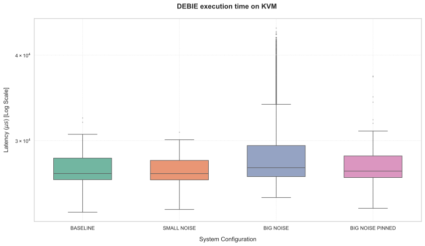


### HUFFENC

| METRIC | BASELINE | STRESS WORKLOAD |
| :--- | :--- | :--- |
| **Mean ± SD** | 16.02 ± 3.39 µs | 26.21 ± 5.01 µs |
| **WCET (Max)** | 64 µs | 69 µs |

**PERCENTAGE INCREMENTS (Stress vs. Baseline):**
* Average Increment: +63.63%
* WCET Increment: +7.81%

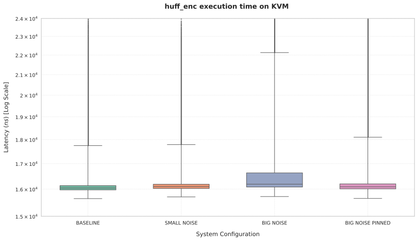


### LIFT

| METRIC | BASELINE | STRESS WORKLOAD |
| :--- | :--- | :--- |
| **Mean ± SD** | 19.44 ± 3.00 µs | 19.42 ± 3.00 µs |
| **WCET (Max)** | 61 µs | 280 µs |

**PERCENTAGE INCREMENTS (Stress vs. Baseline):**
* Average Increment: -0.07%
* WCET Increment: +359.02%

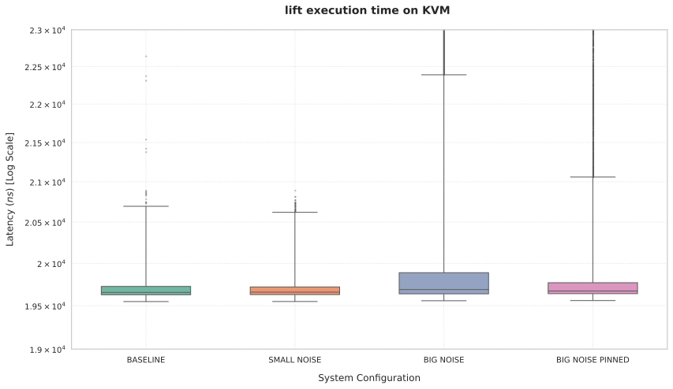

### MATRIX1

| METRIC | BASELINE | STRESS WORKLOAD |
| :--- | :--- | :--- |
| **Mean ± SD** | 0.00 ± 0.00 µs | 0.00 ± 0.01 µs |
| **WCET (Max)** | 1 µs | 6 µs |

**PERCENTAGE INCREMENTS (Stress vs. Baseline):**
* Average Increment: +600.00%
* WCET Increment: +500.00%

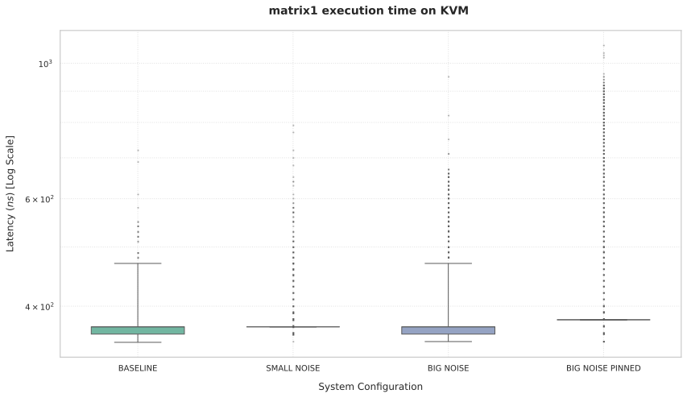

### TEST3

| METRIC | BASELINE | STRESS WORKLOAD |
| :--- | :--- | :--- |
| **Mean ± SD** | 8363.95 ± 31.59 µs | 8457.93 ± 52.13 µs |
| **WCET (Max)** | 9471 µs | 9458 µs |

**PERCENTAGE INCREMENTS (Stress vs. Baseline):**
* Average Increment: +1.12%
* WCET Increment: -0.14%

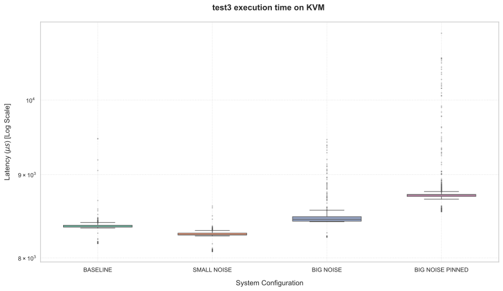