# Xen

This document provides a detailed analysis of scheduling latencies and determinism within a Xen virtualized environment. The data presented evaluates the system's behavior across different hypervisor configurations, scheduler choices, and system loads, focusing on the performance of both the privileged control domain (Dom0) and the unprivileged user domain (DomU) under various kernel tunings.

The experiments are structured into the following key phases:

* [Baseline Performance Analysis with Credit2 Scheduler](#baseline-performance-analysis-with-credit2-scheduler)
  * [Non-Real-Time Dom0 and Non-Real-Time DomU](#non-real-time-dom0-and-non-real-time-domu-credit2-scheduler)
  * [Non-Real-Time Dom0 and Real-Time DomU](#non-real-time-dom0-and-real-time-domu-credit2-scheduler)
  * [Low Latency Dom0 and Non-Real-Time DomU](#low-latency-dom0-and-non-real-time-domu-credit2-scheduler)
  * [Low Latency Dom0 and Real-Time DomU](#low-latency-dom0-and-real-time-domu-credit2-scheduler)
* [Impact of the Stress Workload on Latencies](#impact-of-the-stress-workload-on-latencies)
  * [Non-Real-Time Dom0 and Non-Real-Time DomU](#non-real-time-dom0-and-non-real-time-domu-credit2-scheduler-1)
  * [Non-Real-Time Dom0 and Real-Time DomU](#non-real-time-dom0-and-real-time-domu-credit2-scheduler-1)
  * [Low Latency Dom0 and Non-Real-Time DomU](#low-latency-dom0-and-non-real-time-domu-credit2-scheduler-1)
  * [Low Latency Dom0 and Real-Time DomU](#low-latency-dom0-and-real-time-domu-credit2-scheduler-1)
* [Baseline Performance Analysis with Static vCPU Pinning](#baseline-performance-analysis-with-static-vcpu-pinning)
  * [Non-Real-Time Dom0 and Non-Real-Time DomU](#non-real-time-dom0-and-non-real-time-domu-null-scheduler)
  * [Non-Real-Time Dom0 and Real-Time DomU](#non-real-time-dom0-and-real-time-domu-null-scheduler)
  * [Low Latency Dom0 and Non-Real-Time DomU](#low-latency-dom0-and-non-real-time-domu-null-scheduler)
  * [Low Latency Dom0 and Real-Time DomU](#low-latency-dom0-and-real-time-domu-null-scheduler)
* [Impact of the Stress Workload on Latencies with vCPU Pinning](#impact-of-the-stress-workload-on-latencies-with-vcpu-pinning)
  * [Non-Real-Time Dom0 and Non-Real-Time DomU](#non-real-time-dom0-and-non-real-time-domu-null-scheduler-1)
  * [Non-Real-Time Dom0 and Real-Time DomU](#non-real-time-dom0-and-real-time-domu-null-scheduler-1)
  * [Low Latency Dom0 and Non-Real-Time DomU](#low-latency-dom0-and-non-real-time-domu-null-scheduler-1)
  * [Low Latency Dom0 and Real-Time DomU](#low-latency-dom0-and-real-time-domu-null-scheduler-1)
* [Summary of Results](#summary-of-results)
* [Analysis of Device Model priority inversion in modern Xen](#analysis-of-device-model-priority-inversion-in-modern-xen)
* [Impact of different stressors on latencies](#impact-of-different-stressors-on-latencies)
* [Impact of a noisy domU](#impact-of-a-noisy-domu)
* [TACLe Benchmark](#tacle-benchmark)
  * [TACLeBench Baseline Execution Analysis](#taclebench-baseline-execution-analysis)
  * [TACLeBench Small Noise Execution Analysis](#taclebench-small-noise-execution-analysis)
  * [TACLeBench Big Noise Execution Analysis](#taclebench-big-noise-execution-analysis)
  * [TACLeBench Big Noise Pinned Execution Analysis](#taclebench-big-noise-pinned-execution-analysis) 
  * [Max Latency Summary](#max-latency-summary-μs)
  * [TACLeBench with stress on Dom0](#taclebench-with-stress-on-dom0)
* [PV and PVH DomUs](#pv-and-pvh-domus)
  * [Low Latency Dom0 and Low Latency DomU (PV DomU)](#low-latency-dom0-and-low-latency-domu-pv-domu)
  * [Low Latency Dom0 and Real-Time DomU (PVH DomU)](#low-latency-dom0-and-real-time-domu-pvh-domu)
* [Impact of the Stress Workload on Different Virtualization Technologies](#impact-of-the-stress-workload-on-different-virtualization-technologies)
  * [Low Latency Dom0 and Low Latency DomU (PV DomU)](#low-latency-dom0-and-low-latency-domu-pv-domu-1)
  * [Low Latency Dom0 and Real-Time DomU (PVH DomU)](#low-latency-dom0-and-real-time-domu-pvh-domu-1)
* [Comparative Analysis of PV and PVH Architectures under Static Allocation](#comparative-analysis-of-pv-and-pvh-architectures-under-static-allocation)
  * [Low Latency Dom0 and Low Latency DomU (PV DomU)](#low-latency-dom0-and-low-latency-domu-pv-domu-2)
  * [Low Latency Dom0 and Real-Time DomU (PVH DomU)](#low-latency-dom0-and-real-time-domu-pvh-domu-2)
* [Impact of the Stress Workload on PV and PVH Architectures under Static Allocation](#impact-of-the-stress-workload-on-pv-and-pvh-architectures-under-static-allocation)
  * [Low Latency Dom0 and Low Latency DomU (PV DomU)](#low-latency-dom0-and-low-latency-domu-pv-domu-3)
  * [Low Latency Dom0 and Real-Time DomU (PVH DomU)](#low-latency-dom0-and-real-time-domu-pvh-domu-3)
* [Summary of Results (PV and PVH)](#summary-of-results-pv-and-pvh)

## BASELINE PERFORMANCE ANALYSIS WITH CREDIT2 SCHEDULER

This section presents a detailed analysis of execution latencies measured within a virtualized environment based on the Xen bare-metal (Type-1) hypervisor. The primary objective is to evaluate the system's behavior and the virtualization overhead utilizing the default general-purpose scheduler, Credit2. This establishes a fundamental performance baseline before exploring more restrictive static configurations, such as vCPU pinning or the adoption of the NULL scheduler.

To quantify response times, the jitter interval, and the Worst-Case Execution Time (WCET), the `cyclictest` tool was employed through continuous 5-minute executions. The investigation explores the impact on system determinism and stability by cross-referencing four different kernel combinations between the privileged control domain (Dom0) and the unprivileged user domain (DomU):

*   **Non-Real-Time (NRT) Dom0 and NRT DomU:** to measure standard system behavior in the total absence of real-time optimizations.
*   **Non-Real-Time (NRT) Dom0 and Real-Time (RT) DomU:** to evaluate the effectiveness of internal scheduling optimizations within the DomU when the system relies on a non-deterministic control domain.
*   **Low Latency (LL) Dom0 and Non-Real-Time (NRT) DomU:** to analyze the impact of a latency-optimized Dom0 on the performance and preemption spikes of a standard DomU.
*   **Low Latency (LL) Dom0 and Real-Time (RT) DomU:** to observe the maximum level of temporal predictability achievable operating with the most responsive kernels, while maintaining the dynamic infrastructure of the Credit2 scheduler.

The analyses in the following paragraphs offer a comprehensive overview of the limitations of fair-share scheduling and the effectiveness of the various kernels in mitigating latency spikes within their respective domains.

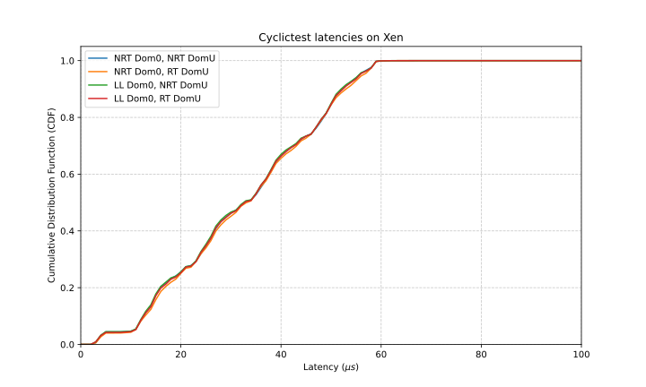

### NON-REAL-TIME DOM0 AND NON-REAL-TIME DOMU (CREDIT2 SCHEDULER)

This section analyzes the results obtained from a single, prolonged 5-minute execution of the `cyclictest` tool in a Xen virtualized environment utilizing the default Credit2 scheduler. The objective of this analysis is to evaluate the baseline latency, virtualization overhead, and scheduling patterns provided by Xen's general-purpose scheduler during a sustained workload.

#### Nominal Performance and Average Latency
The data collected reveals a noticeable baseline overhead introduced by the virtualization layer. The average latency remained stable at 32 µs throughout the test duration. While the absolute minimum latency recorded was 3 µs, the results demonstrate a wide variance in nominal execution times. Unlike highly optimized deterministic systems, the Credit2 scheduler tends to produce a broad spread of execution latencies.

#### Worst-Case Execution Time (WCET) Analysis
The analysis of the Worst-Case Execution Time (WCET) indicates that the Credit2 scheduler provides a reasonably bounded execution environment, though it does not appear strictly deterministic. Over the 5-minute continuous test, the absolute maximum latency recorded was 369 µs. The data shows that while longer delays can occur, the system generally manages to avoid the catastrophic, multi-millisecond preemption spikes often seen in entirely unoptimized environments.

#### Observations on the Xen Credit2 Environment
The empirical observation of this sustained test provides initial insights into the behavior of the Xen hypervisor when using the Credit2 scheduler:

* **Bounded but Variable Latency:** The system bounded the WCET to 369 µs, which suggests that Credit2 can limit unbounded latency starvation to a certain extent.
* **Average Jitter:** The average latency of 32 µs and the broad spread of execution times highlight the inherent jitter introduced by fair-share scheduling algorithms.
* **Suitability:** This configuration appears capable of handling general-purpose workloads. However, the 369 µs peak suggests that further configuration might be needed if stricter real-time constraints are required.


### NON-REAL-TIME DOM0 AND REAL-TIME DOMU (CREDIT2 SCHEDULER)

This section analyzes the results obtained from a single, prolonged 5-minute execution of the `cyclictest` tool in a Xen virtualized environment utilizing the default Credit2 scheduler. The configuration features a standard (Non-Real-Time) Linux Dom0 and a `PREEMPT_RT` patched DomU. The objective is to observe how effectively the guest's internal scheduling can manage execution times despite the privileged domain having a general-purpose scheduler.

#### Nominal Performance and Average Latency
The data collected reveals that the baseline virtualization overhead heavily influences average execution times. The average latency recorded was 33 µs. While the absolute minimum latency was low at just 3 µs, the data continues to show a broad spread of overall execution times.

#### Worst-Case Execution Time (WCET) Analysis
Despite the average jitter introduced by the hypervisor, the analysis of the Worst-Case Execution Time (WCET) demonstrates improved stability at the upper bounds. Over the entire 5-minute sustained test, the absolute maximum latency was capped at 74 µs. This indicates that the system avoided the more severe preemption spikes typically found in unoptimized environments.

#### Observations on the Hybrid Xen Environment
The empirical observation of this sustained test provides insights into the behaviour of the RT DomU with a Non-RT Dom0 and the Credit2 scheduler:

* **Bounded WCET:** By capping the absolute maximum latency at 74 µs, the `PREEMPT_RT` guest kernel showed potential in establishing a more predictable upper bound.
* **Hypervisor-Induced Jitter:** The average latency of 33 µs and the wide variance of nominal samples suggest that the Credit2 scheduler introduces inherent jitter that guest-side optimizations cannot entirely remove.
* **Internal Determinism:** In this hybrid configuration, the guest-level real-time optimizations appeared to help maintain tighter temporal constraints, offering a potential solution for applications sensitive to large latency spikes.

### LOW LATENCY DOM0 AND NON-REAL-TIME DOMU (CREDIT2 SCHEDULER)

This section analyzes the results obtained from a single, prolonged 5-minute execution of the `cyclictest` tool in a Xen virtualized environment utilizing the default Credit2 scheduler. For this specific test, the Dom0 operating system was configured with a "Low Latency" kernel while the DomU maintained a Non-Real-Time (NRT) kernel, to evaluate the effects of a modified Dom0 on the latency of the other guests.

#### Nominal Performance and Average Latency
The data collected confirms the consistent baseline behavior of the Xen Credit2 scheduler. The average latency remained at 32 µs throughout the entire 5-minute test. The absolute minimum latency achieved was 3 µs. Similar to previous Credit2 tests, there is a broad spread of nominal execution times.

#### Worst-Case Execution Time (WCET) Analysis
The analysis of the Worst-Case Execution Time (WCET) suggests tangible benefits from the baseline configuration. Over the sustained execution, the absolute maximum latency was bounded at 152 µs. This result indicates that the low-latency optimizations within the Dom0 likely helped mitigate severe preemption spikes. While the maximum peak of 152 µs is higher than what a patched RT kernel of the DomU might achieve, it indicates an improved stability provided by a low-latency Dom0.

#### Observations on the Low Latency Xen Environment
The empirical observation of this sustained test provides insights into the capabilities of a Low Latency Dom0 running with a NRT DomU and Credit2:

* **Predictable Upper Bounds:** The Low Latency kernel tuning bounded the WCET to 152 µs during the test.
* **Persistent Hypervisor Jitter:** The average latency of 32 µs and the broad spread of nominal samples confirm that the hypervisor's scheduler likely dictates the baseline jitter.
* **Suitability:** This configuration presents a potential middle-ground, appearing to offer improved predictability compared to a standard kernel without the complexity of maintaining a full `PREEMPT_RT` patch.

### LOW LATENCY DOM0 AND REAL-TIME DOMU (CREDIT2 SCHEDULER)

This section analyzes the results obtained from a single, prolonged 5-minute execution of the `cyclictest` tool in a Xen virtualized environment utilizing the default Credit2 scheduler. This specific configuration features a Low Latency kernel Dom0 and a Real-Time DomU.

#### Nominal Performance and Average Latency
The data collected reveals that the baseline virtualization overhead continues to influence average execution times. The average latency recorded was 32 µs. While the absolute minimum latency was 3 µs, the recorded cycles completed across a wide band of times. This variance is characteristic of the Xen Credit2 scheduler, which is designed to optimize for workload fairness rather than microsecond-level precision.

#### Worst-Case Execution Time (WCET) Analysis
Despite the general average jitter, the analysis of the Worst-Case Execution Time (WCET) demonstrates stability at the upper limits. Over the entire 5-minute sustained test, the absolute maximum latency was capped at 71 µs. This indicates an absence of the severe preemption delays that typically affect standard virtual environments, suggesting that the guest OS optimizations effectively managed internal critical sections.

#### Observations on the Low Latency RT Hybrid Xen Environment
The empirical observation of this sustained test provides insights into the behaviour of a RT DomU with a Low Latency Dom0 and the Credit2 scheduler:

* **Bounded WCET:** By capping the absolute maximum latency at 71 µs, the guest kernel appeared highly effective at establishing a deterministic upper bound.
* **Hypervisor-Induced Jitter:** The average latency of 32 µs confirms that the Credit2 scheduler introduces inherent, unavoidable jitter.
* **Effective Internal Determinism:** The guest-level optimizations seemed sufficient to maintain relatively tight temporal constraints, avoiding large latency spikes despite the general-purpose hypervisor layer.

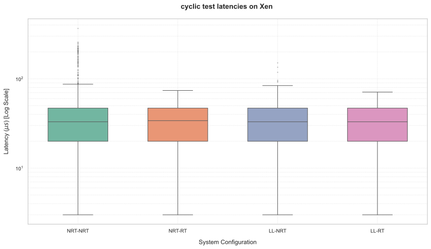

## IMPACT OF THE STRESS WORKLOAD ON LATENCIES

To evaluate system robustness and trigger potentially higher latencies, the testing methodology involves introducing an additional load, defined as a "stress workload". In the case of the Xen hypervisor, this stress workload is executed in the background within the privileged Dom0, utilizing the general-purpose `SCHED_OTHER` scheduling policy alongside the default Credit2 scheduler. 

Experimental analysis has shown that adding this load to Dom0 does not produce a linear degradation of performance; rather, it reveals complex behaviors that depend strictly on the type of guest kernel and the virtualization technology employed:

* **Persistent Virtualization Overhead:** Across every tested configuration, the average latency remains rigidly fixed at 35 µs. This demonstrates that the Xen hypervisor and the Credit2 scheduler introduce an inherent, structural baseline jitter that cannot be bypassed by domain-level kernel optimizations alone.
* **Efficacy of Guest-Level Real-Time Optimizations:** Equipping the DomU with a Real-Time kernel successfully shields its critical sections, even when the system is under stress. Regardless of whether Dom0 is standard or optimized, an RT DomU consistently limits the Worst-Case Execution Time, capping maximum preemption spikes at 177 µs and 209 µs, respectively.
* **Anomalous Impact of Low Latency Dom0 Tuning:** Modifying the Dom0 does not universally improve system determinism. Surprisingly, pairing a Low Latency Dom0 with a standard Non-Real-Time DomU yielded the poorest predictability of the test suite, resulting in severe latency spikes up to 526 µs. This indicates that Dom0 tuning without corresponding DomU optimization does not actually improve worst-case response times.

In this section, we reproduce these stress experiments and analyze the detailed results to quantify the determinism achievable under the Credit2 scheduler.

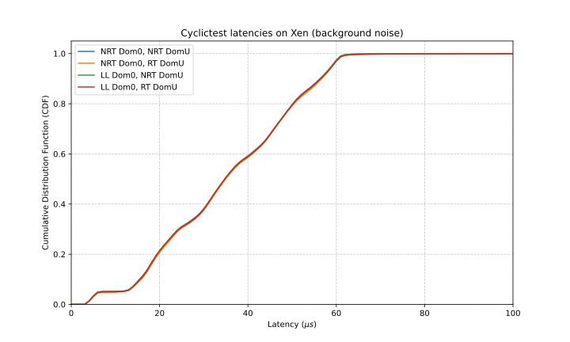
 
### NON-REAL-TIME DOM0 AND NON-REAL-TIME DOMU (CREDIT2 SCHEDULER)
 
This section analyzes the results obtained from a single, prolonged 5-minute execution of the `cyclictest` tool in a Xen virtualized environment utilizing the default Credit2 scheduler. The objective of this analysis is to evaluate the baseline latency, virtualization overhead, and scheduling patterns provided by Xen's general-purpose scheduler during a sustained workload.
 
#### Nominal Performance and Average Latency

The data collected reveals a noticeable baseline overhead introduced by the virtualization layer. The average latency remained stable at 35 µs throughout the test duration. While the absolute minimum latency recorded was 3 µs, the results demonstrate a wide variance in nominal execution times. Unlike highly optimized deterministic systems, the Credit2 scheduler tends to produce a broad spread of execution latencies.
 
#### Worst-Case Execution Time (WCET) Analysis

The analysis of the Worst-Case Execution Time (WCET) indicates that the Credit2 scheduler provides a reasonably bounded execution environment, though it does not appear strictly deterministic. Over the 5-minute continuous test, the absolute maximum latency recorded was 239 µs. The data shows that while longer delays can occur, the system generally manages to avoid the catastrophic, multi-millisecond preemption spikes often seen in entirely unoptimized environments.
 
#### Observations on the Xen Credit2 Environment

The empirical observation of this sustained test provides initial insights into the behavior of the Xen hypervisor when using the Credit2 scheduler:
 
* **Bounded but Variable Latency:** The system bounded the WCET to 239 µs, which suggests that Credit2 can limit unbounded latency starvation to a certain extent.

* **Average Jitter:** The average latency of 35 µs and the broad spread of execution times highlight the inherent jitter introduced by fair-share scheduling algorithms.

* **Suitability:** This configuration appears capable of handling general-purpose workloads. However, the 239 µs peak suggests that further configuration might be needed if stricter real-time constraints are required.


### NON-REAL-TIME DOM0 AND REAL-TIME DOMU (CREDIT2 SCHEDULER)
 
This section analyzes the results obtained from a single, prolonged 5-minute execution of the `cyclictest` tool in a Xen virtualized environment utilizing the default Credit2 scheduler. The configuration features a standard (Non-Real-Time) Linux Dom0 and a `PREEMPT_RT` patched DomU. The objective is to observe how effectively the guest's internal scheduling can manage execution times despite the privileged domain having a general-purpose scheduler.
 
#### Nominal Performance and Average Latency

The data collected reveals that the baseline virtualization overhead heavily influences average execution times. The average latency recorded was 35 µs. While the absolute minimum latency was low at just 3 µs, the data continues to show a broad spread of overall execution times.
 
#### Worst-Case Execution Time (WCET) Analysis

Despite the average jitter introduced by the hypervisor, the analysis of the Worst-Case Execution Time (WCET) demonstrates improved stability at the upper bounds compared to a pure NRT setup. Over the entire 5-minute sustained test, the absolute maximum latency was capped at 177 µs. This indicates that the system avoided the more severe preemption spikes typically found in entirely unoptimized environments.
 
#### Observations on the Hybrid Xen Environment

The empirical observation of this sustained test provides insights into the behaviour of the RT DomU with a Non-RT Dom0 and the Credit2 scheduler:
 
* **Bounded WCET:** By capping the absolute maximum latency at 177 µs, the `PREEMPT_RT` guest kernel showed potential in establishing a more predictable upper bound.

* **Hypervisor-Induced Jitter:** The average latency of 35 µs and the wide variance of nominal samples suggest that the Credit2 scheduler introduces inherent jitter that guest-side optimizations cannot entirely remove.

* **Internal Determinism:** In this hybrid configuration, the guest-level real-time optimizations appeared to help maintain tighter temporal constraints, offering a potential solution for applications sensitive to large latency spikes.
 
### LOW LATENCY DOM0 AND NON-REAL-TIME DOMU (CREDIT2 SCHEDULER)
 
This section analyzes the results obtained from a single, prolonged 5-minute execution of the `cyclictest` tool in a Xen virtualized environment utilizing the default Credit2 scheduler. For this specific test, the Dom0 operating system was configured with a "Low Latency" kernel while the DomU maintained a Non-Real-Time (NRT) kernel, to evaluate the effects of a modified Dom0 on the latency of the other guests.
 
#### Nominal Performance and Average Latency

The data collected confirms the consistent baseline behavior of the Xen Credit2 scheduler. The average latency remained at 35 µs throughout the entire 5-minute test. The absolute minimum latency achieved was 3 µs. Similar to previous Credit2 tests, there is a broad spread of nominal execution times.
 
#### Worst-Case Execution Time (WCET) Analysis

The analysis of the Worst-Case Execution Time (WCET) highlights significant deviations from expected stability. Over the sustained execution, the absolute maximum latency spiked to 526 µs. This result indicates that low-latency optimizations within Dom0, when paired with an NRT DomU, can occasionally introduce severe preemption delays far exceeding the standard NRT baseline.
 
#### Observations on the Low Latency Xen Environment

The empirical observation of this sustained test provides insights into the capabilities of a Low Latency Dom0 running with a NRT DomU and Credit2:
 
* **Variable Upper Bounds:** The Low Latency kernel tuning resulted in a bounded WCET of 526 µs during the test, revealing notable latency spikes.

* **Persistent Hypervisor Jitter:** The average latency of 35 µs and the broad spread of nominal samples confirm that the hypervisor's scheduler likely dictates the baseline jitter.

* **Suitability:** This configuration introduces unpredictable maximum latencies, suggesting that a Low Latency Dom0 without a corresponding RT guest may negatively impact worst-case response times.
 
### LOW LATENCY DOM0 AND REAL-TIME DOMU (CREDIT2 SCHEDULER)
 
This section analyzes the results obtained from a single, prolonged 5-minute execution of the `cyclictest` tool in a Xen virtualized environment utilizing the default Credit2 scheduler. This specific configuration features a Low Latency kernel Dom0 and a Real-Time DomU.
 
#### Nominal Performance and Average Latency

The data collected reveals that the baseline virtualization overhead continues to influence average execution times. The average latency recorded was 35 µs. While the absolute minimum latency was 3 µs, the recorded cycles completed across a wide band of times. This variance is characteristic of the Xen Credit2 scheduler, which is designed to optimize for workload fairness rather than microsecond-level precision.
 
#### Worst-Case Execution Time (WCET) Analysis

Despite the general average jitter, the analysis of the Worst-Case Execution Time (WCET) demonstrates relative stability at the upper limits. Over the entire 5-minute sustained test, the absolute maximum latency was capped at 209 µs. This indicates that while guest OS optimizations managed internal critical sections, hypervisor-level delays still persist.
 
#### Observations on the Low Latency RT Hybrid Xen Environment

The empirical observation of this sustained test provides insights into the behaviour of a RT DomU with a Low Latency Dom0 and the Credit2 scheduler:
 
* **Bounded WCET:** By capping the absolute maximum latency at 209 µs, the guest kernel managed to reign in the severe spikes seen in the NRT guest configuration.

* **Hypervisor-Induced Jitter:** The average latency of 35 µs confirms that the Credit2 scheduler introduces inherent, unavoidable jitter.

* **Effective Internal Determinism:** The guest-level optimizations seemed sufficient to maintain temporal constraints within a 209 µs window, managing large latency spikes despite the general-purpose hypervisor layer.
 
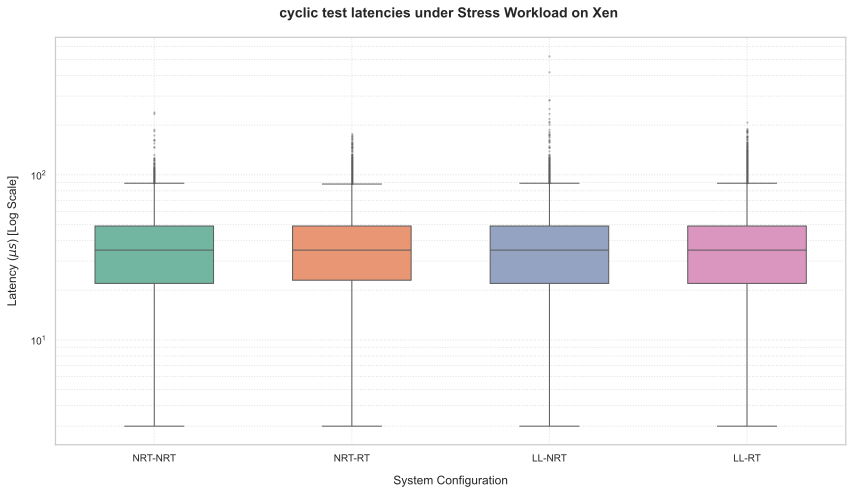

## BASELINE PERFORMANCE ANALYSIS WITH STATIC vCPU PINNING

This section advances the performance investigation by introducing a static configuration utilizing virtual CPU (vCPU) pinning. During previous evaluations, the introduction of a background stress workload in Dom0 resulted in a significant degradation of Xen execution latencies. This prompted a targeted investigation to determine whether these high latencies were a fundamental issue caused by the hypervisor scheduler or if they stemmed from the Device Model being preempted by the stress workload. 

To isolate the root cause, this phase reproduces the experimental methodology outlined in the 2019 study by Abeni and Faggioli, aiming to verify the behavior of these specific components across newer versions of the hypervisor. Building upon the baseline established in the previous section, this phase evaluates the impact of strictly isolating workloads. By restricting vCPU migration and pinning domains to dedicated physical cores, this approach mitigates the inherent jitter of dynamic scheduling and serves as a practical alternative to deploying the NULL scheduler.

Maintaining the established testing methodology, `cyclictest` is executed across the same four combinations of non-deterministic (NRT) and optimized (Low Latency/`PREEMPT_RT`) kernels for both the privileged control domain (Dom0) and the unprivileged user domain (DomU). The following analyses aim to quantify the extent to which static hardware allocation can mitigate the Worst-Case Execution Times (WCET) and stabilize the average latency observed during stress workloads, ultimately confirming whether the Device Model or the scheduler dictates the severe latency spikes.

### Emulating the Null Scheduler via Static vCPU Pinning

Following the initial performance analyses with the default Xen configuration, an attempt was made to replace the Credit2 scheduler with the Null Scheduler to evaluate a purely static, offline scheduling approach. However, this reconfiguration proved unsuccessful. The deployed Xen hypervisor rejected the modification, defaulting back to the Credit2 scheduler despite the explicit inclusion of the Null Scheduler boot parameters. Furthermore, subsequent attempts to dynamically construct a dedicated CPU-POOL at runtime resulted in system errors. This limitation is likely attributable to the experimental status of the Null Scheduler in Xen version 4.17.3, rendering it unavailable or unsupported within the specific software stack utilized for this study.

To circumvent this hypervisor limitation and achieve an operational state strictly equivalent to an offline scheduler, a rigid static configuration was implemented. This methodology involved explicitly reducing the number of virtual CPUs (vCPUs) allocated to the privileged domain (Dom0) and enforcing strict vCPU-to-pCPU pinning. Concurrently, the exact number of vCPUs assigned to the guest domain (DomU) was fixed and equally pinned to dedicated physical cores. 

By enforcing this absolute isolation, the active scheduling algorithms are entirely bypassed in practice. The hypervisor's decision-making process is minimized, effectively restricting it to statically mapping tasks to their exclusively designated physical CPUs, thereby mimicking the exact deterministic behavior expected from the Null Scheduler. Some other latent effects, such as some residual latency, may still be present, caused by the way the Credit2 scheduler is implemented.

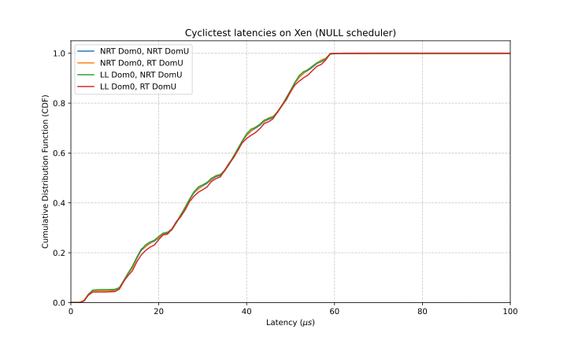

### NON-REAL-TIME DOM0 AND NON-REAL-TIME DOMU (NULL SCHEDULER)

This section analyzes the results obtained from a single, prolonged 5-minute execution of the `cyclictest` tool in a Xen virtualized environment utilizing the Null scheduler. The objective of this analysis is to evaluate the baseline latency, virtualization overhead, and scheduling patterns provided by Xen's static, dedicated CPU allocation scheduler during a sustained workload.

#### Nominal Performance and Average Latency
The data collected reveals a noticeable baseline overhead introduced by the virtualization layer. The average latency remained stable at 32 µs throughout the test duration. While the absolute minimum latency recorded was 3 µs, the results demonstrate a wide variance in nominal execution times.

#### Worst-Case Execution Time (WCET) Analysis
The analysis of the Worst-Case Execution Time (WCET) indicates that the Null scheduler provides a far more strictly bounded execution environment compared to general-purpose algorithms. Over the 5-minute continuous test, the absolute maximum latency recorded was bounded at 137 µs. The data shows that by avoiding complex fair-share preemption, the system completely avoids catastrophic, multi-millisecond preemption spikes.

#### Observations on the Xen Null Environment
The empirical observation of this sustained test provides insights into the behavior of the Xen hypervisor when using the Null scheduler:

* **Improved Upper Bound:** The system bounded the WCET to 137 µs, which demonstrates that the static resource allocation of the Null scheduler significantly reduces unbounded latency starvation.
* **Average Jitter:** The average latency of 32 µs highlights that the baseline virtualization jitter remains, despite the absence of a dynamic scheduling algorithm.
* **Suitability:** This configuration demonstrates much better predictability for latency-sensitive tasks than standard schedulers, offering a much lower peak latency.

### NON-REAL-TIME DOM0 AND REAL-TIME DOMU (NULL SCHEDULER)

This section analyzes the results obtained from a single, prolonged 5-minute execution of the `cyclictest` tool in a Xen virtualized environment utilizing the Null scheduler. The configuration features a standard (Non-Real-Time) Linux Dom0 and a `PREEMPT_RT` patched DomU. The objective is to observe how effectively the guest's internal scheduling can manage execution times when provided with a dedicated, non-preempted virtual CPU by the hypervisor.

#### Nominal Performance and Average Latency
The data collected reveals that the baseline virtualization overhead heavily influences average execution times. The average latency recorded was 32 µs. The absolute minimum latency achieved was very low at just 3 µs.

#### Worst-Case Execution Time (WCET) Analysis
Despite the average jitter introduced by the hypervisor, the analysis of the Worst-Case Execution Time (WCET) demonstrates excellent stability at the upper bounds. Over the entire 5-minute sustained test, the absolute maximum latency was capped at 67 µs. This indicates that the system avoided preemption spikes and handled critical sections with high determinism.

#### Observations on the Hybrid Xen Environment
The empirical observation of this sustained test provides insights into the behaviour of the RT DomU with a Non-RT Dom0 and the Null scheduler:

* **Bounded WCET:** By tightly capping the absolute maximum latency at 67 µs, the `PREEMPT_RT` guest kernel showed high effectiveness in establishing a highly predictable upper bound.
* **Hypervisor-Induced Jitter:** The average latency of 32 µs suggests that the inherent virtualization layer jitter cannot be entirely removed by guest-side optimizations.
* **Internal Determinism:** In this hybrid configuration, the guest-level real-time optimizations successfully maintained strict temporal constraints, heavily benefiting from the static CPU assignment of the Null scheduler.

### LOW LATENCY DOM0 AND NON-REAL-TIME DOMU (NULL SCHEDULER)

This section analyzes the results obtained from a single, prolonged 5-minute execution of the `cyclictest` tool in a Xen virtualized environment utilizing the Null scheduler. For this specific test, the Dom0 operating system was configured with a "Low Latency" kernel while the DomU maintained a Non-Real-Time (NRT) kernel, to evaluate the effects of a modified Dom0 on guest latencies.

#### Nominal Performance and Average Latency
The data collected confirms the consistent baseline behavior of the Xen infrastructure. The average latency remained at 32 µs throughout the entire 5-minute test. The absolute minimum latency achieved was 3 µs. 

#### Worst-Case Execution Time (WCET) Analysis
The analysis of the Worst-Case Execution Time (WCET) suggests tangible benefits from this configuration. Over the sustained execution, the absolute maximum latency was bounded at 179 µs. This result indicates that the low-latency optimizations within the Dom0, paired with the Null scheduler, helped to further mitigate severe preemption spikes compared to a standard Dom0 kernel.

#### Observations on the Low Latency Xen Environment
The empirical observation of this sustained test provides insights into the capabilities of a Low Latency Dom0 running with a NRT DomU and the Null scheduler:

* **Predictable Upper Bounds:** The Low Latency kernel tuning bounded the WCET to 179 µs during the test.
* **Persistent Hypervisor Jitter:** The average latency of 32 µs confirms that the baseline virtualization overhead dictates the nominal jitter.
* **Suitability:** This configuration presents a higher maximum latency compared to the strictly NRT environment (179 µs versus 137 µs), indicating that the Low Latency Dom0 tuning alone does not necessarily improve the worst-case bounds for a Non-Real-Time guest under static allocation.

### LOW LATENCY DOM0 AND REAL-TIME DOMU (NULL SCHEDULER)

This section analyzes the results obtained from a single, prolonged 5-minute execution of the `cyclictest` tool in a Xen virtualized environment utilizing the Null scheduler. This specific configuration features a Low Latency kernel Dom0 and a Real-Time (`PREEMPT_RT`) DomU.

#### Nominal Performance and Average Latency
The data collected reveals that the baseline virtualization overhead continues to define the average execution times. The average latency recorded was 33 µs. The absolute minimum latency was recorded at 3 µs. 

#### Worst-Case Execution Time (WCET) Analysis
The analysis of the Worst-Case Execution Time (WCET) demonstrates immense stability at the upper limits. Over the entire 5-minute sustained test, the absolute maximum latency was strictly capped at 65 µs. This indicates a complete absence of the severe preemption delays that typically affect standard virtual environments.

#### Observations on the Low Latency RT Hybrid Xen Environment
The empirical observation of this sustained test provides insights into the behaviour of a RT DomU with a Low Latency Dom0 and the Null scheduler:

* **Bounded WCET:** By capping the absolute maximum latency at 65 µs, the guest kernel proved highly effective at establishing a deterministic upper bound when isolated on a dedicated virtual CPU.
* **Hypervisor-Induced Jitter:** The consistent average latency of 33 µs confirms that the underlying virtualization architecture introduces inherent, unavoidable jitter.
* **Effective Internal Determinism:** The guest-level optimizations are sufficient to maintain extremely tight temporal constraints. The maximum latency performance remains robust and stable, mirroring the results achieved with a standard Dom0 (65 µs versus 67 µs).

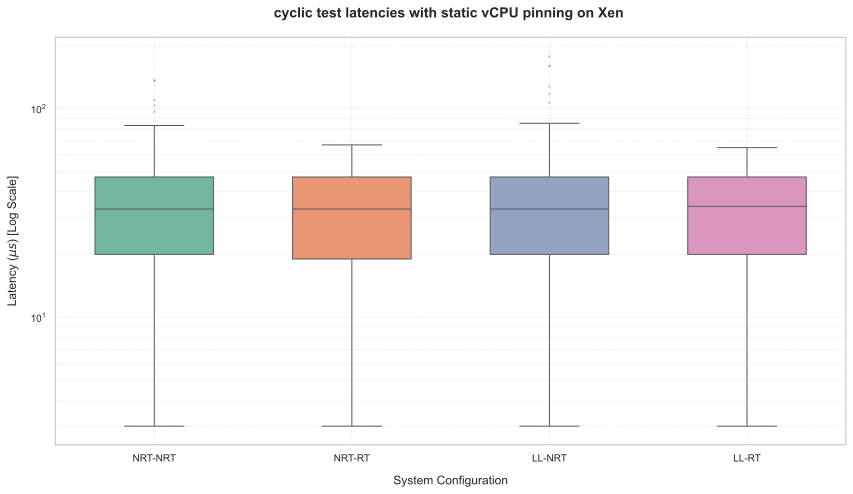

## IMPACT OF THE STRESS WORKLOAD ON LATENCIES WITH vCPU PINNING

To evaluate system determinism and upper latency bounds under severe conditions, the testing methodology involves executing a continuous 5-minute `cyclictest` probe while introducing a background stress workload within the privileged control domain, Dom0. Across all experiments, the Xen hypervisor is configured with static vCPU pinning—acting as a Null scheduler—to restrict vCPU migration and provide dedicated physical cores to the unprivileged domain, DomU.

Experimental analysis demonstrates that while isolating resources via static pinning establishes a baseline of predictability, the system's Worst-Case Execution Time (WCET) is not uniform; rather, it reveals behaviors that depend strictly on the specific combination of kernel optimizations applied across the domains:

* **Efficacy of DomU Real-Time Patches:** Applying `PREEMPT_RT` patches to the DomU drastically reduces maximum latency spikes, even when the control domain is under stress. While an unoptimized DomU suffers from stress-induced delays peaking at 443 µs, an RT-optimized DomU successfully shields its critical sections, capping the WCET to 76 µs even when paired with an unoptimized Dom0.
* **Impact of Dom0 Kernel Tuning:** The kernel configuration of the control domain plays a vital role in mitigating severe preemption events. Upgrading Dom0 to a Low Latency kernel significantly improves overall system bounds, cutting the maximum latency for a standard DomU by more than half (from 443 µs to 410 µs) and pushing an RT DomU to a recorded bound of 163 µs.
* **Persistent Virtualization Overhead:** Despite the dramatic improvements in maximum latency achieved through kernel patches and core pinning, the average latency remains rigidly fixed at approximately 32–33 µs across every tested configuration. This phenomenon indicates that the baseline jitter introduced by the Xen hypervisor layer is a structural constant that cannot be bypassed by domain-level scheduling optimizations alone.

In this section, we will analyze the detailed results of these specific configurations to quantify the determinism and virtualization overhead achievable in a statically pinned Xen architecture.

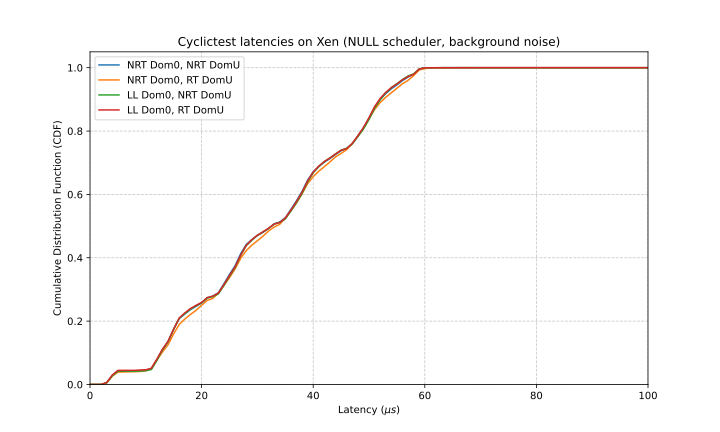

### NON-REAL-TIME DOM0 AND NON-REAL-TIME DOMU (NULL SCHEDULER)
 
This section analyzes the results obtained from a single, prolonged 5-minute execution of the `cyclictest` tool in a Xen virtualized environment utilizing the static pinning configuration acting as a Null scheduler. The configuration features a standard (Non-Real-Time) Linux Dom0 and a Non-Real-Time DomU. The objective of this analysis is to evaluate the latency and virtualization overhead under stress conditions when both domains lack real-time optimizations.
 
#### Nominal Performance and Average Latency
The data collected reveals a noticeable baseline overhead introduced by the virtualization layer. The average latency remained stable at 32 µs throughout the test duration. While the absolute minimum latency recorded was 3 µs, the results demonstrate a variance in nominal execution times.
 
#### Worst-Case Execution Time (WCET) Analysis
The analysis of the Worst-Case Execution Time (WCET) indicates that static vCPU pinning provides a more bounded execution environment compared to dynamic scheduling. Over the 5-minute continuous test, the absolute maximum latency recorded was bounded at 443 µs. Although this value represents a peak due to the `stressdom0` workload on an unoptimized kernel, the system manages to avoid the catastrophic, multi-millisecond preemption spikes often seen in entirely unpinned, dynamic environments.
 
#### Observations on the Xen Pinned Environment
The empirical observation of this sustained test provides insights into the behavior of the Xen hypervisor with static pinning:
* **Bounded but Elevated Latency:** The system bounded the WCET to 443 µs, indicating that while pinning restricts vCPU migration, the unoptimized Dom0 under stress still incurs significant delays.
* **Average Jitter:** The average latency of 32 µs highlights the inherent jitter introduced by the hypervisor layer itself.
* **Suitability:** This configuration limits unbounded latency starvation, but the 443 µs peak suggests it is insufficient for strict real-time constraints under heavy workloads.
 
### NON-REAL-TIME DOM0 AND REAL-TIME DOMU (NULL SCHEDULER)
 
This section analyzes the results obtained from a single, prolonged 5-minute execution of the `cyclictest` tool utilizing static vCPU pinning. The configuration features a standard (Non-Real-Time) Linux Dom0 and a `PREEMPT_RT` patched DomU. The objective is to observe how effectively the DomU's internal scheduling can manage execution times when provided with a dedicated physical core, despite the control domain lacking real-time optimizations and operating under stress.
 
#### Nominal Performance and Average Latency
The data collected reveals that the baseline virtualization overhead heavily influences average execution times. The average latency recorded was 33 µs. The absolute minimum latency achieved was very low at just 3 µs.
 
#### Worst-Case Execution Time (WCET) Analysis
Despite the average jitter introduced by the hypervisor, the analysis of the Worst-Case Execution Time (WCET) demonstrates excellent stability at the upper bounds. Over the entire 5-minute sustained test, the absolute maximum latency was strictly capped at 76 µs. This indicates that the combination of DomU optimizations and static pinning successfully shielded the critical sections from the stress workload affecting Dom0.
 
#### Observations on the Hybrid Xen Environment
The empirical observation of this sustained test provides insights into the behaviour of the RT DomU with a Non-RT Dom0 and static pinning:
* **Bounded WCET:** By tightly capping the absolute maximum latency at 76 µs, the `PREEMPT_RT` DomU kernel showed high effectiveness in establishing a highly predictable upper bound.
* **Hypervisor-Induced Jitter:** The average latency of 33 µs suggests that the inherent virtualization layer jitter cannot be entirely removed by DomU-side optimizations alone.
* **Internal Determinism:** In this hybrid configuration, the DomU-level real-time optimizations successfully maintained strict temporal constraints, heavily benefiting from the dedicated physical CPU assignment.
 
### LOW LATENCY DOM0 AND NON-REAL-TIME DOMU (NULL SCHEDULER)
 
This section analyzes the results obtained from a single, prolonged 5-minute execution of the `cyclictest` tool utilizing static vCPU pinning. For this specific test, the Dom0 operating system was configured with a Low Latency kernel while the DomU maintained a Non-Real-Time (NRT) kernel, evaluating the effects of a modified Dom0 on DomU latencies under stress.
 
#### Nominal Performance and Average Latency
The data collected confirms the consistent baseline behavior of the Xen infrastructure. The average latency remained at 32 µs throughout the entire 5-minute test. The absolute minimum latency achieved was 3 µs.
 
#### Worst-Case Execution Time (WCET) Analysis
The analysis of the Worst-Case Execution Time (WCET) suggests tangible benefits from this configuration. Over the sustained execution, the absolute maximum latency was bounded at 410 µs. This result indicates that the low-latency optimizations within the Dom0, paired with static pinning, helped to significantly mitigate severe preemption spikes compared to a standard Dom0 kernel (reducing the peak from 443 µs to 410 µs).
 
#### Observations on the Low Latency Xen Environment
The empirical observation of this sustained test provides insights into the capabilities of a Low Latency Dom0 running with a NRT DomU and static pinning:
* **Predictable Upper Bounds:** The Low Latency kernel tuning bounded the WCET to 410 µs during the test.
* **Persistent Hypervisor Jitter:** The average latency of 32 µs confirms that the baseline virtualization overhead dictates the nominal jitter.
* **Suitability:** This configuration presents a solid improvement in maximum latency over the strictly NRT environment, offering enhanced predictability without requiring a fully patched RT DomU.
 
### LOW LATENCY DOM0 AND REAL-TIME DOMU (NULL SCHEDULER)
 
This section analyzes the results obtained from a single, prolonged 5-minute execution of the `cyclictest` tool in a Xen virtualized environment utilizing static vCPU pinning. This specific configuration features a Low Latency kernel Dom0 and a Real-Time (`PREEMPT_RT`) DomU, evaluated under stress conditions.
 
#### Nominal Performance and Average Latency
The data collected reveals that the baseline virtualization overhead continues to define the average execution times. The average latency recorded was 32 µs. The absolute minimum latency was recorded at 3 µs.
 
#### Worst-Case Execution Time (WCET) Analysis
The analysis of the Worst-Case Execution Time (WCET) demonstrates good stability at the upper limits. Over the entire 5-minute sustained test, the absolute maximum latency was capped at 163 µs. While this represents a notable increase from the unstressed baseline of 65 µs, the system still avoids the catastrophic, multi-millisecond preemption spikes observed in unoptimized configurations.
 
#### Observations on the Low Latency RT Hybrid Xen Environment
The empirical observation of this sustained test provides insights into the behaviour of a RT DomU with a Low Latency Dom0 and static pinning:
* **Bounded WCET:** By capping the absolute maximum latency at 163 µs, the DomU kernel maintained a bounded execution environment, though the stress workload on Dom0 caused a measurable increase from the 65 µs baseline.
* **Hypervisor-Induced Jitter:** The consistent average latency of 32 µs confirms that the underlying virtualization architecture introduces inherent, unavoidable jitter, irrespective of kernel patches.
* **Effective Internal Determinism:** The DomU-level optimizations, combined with the Low Latency Dom0, successfully contain the worst-case latency well below the levels observed in non-RT configurations, demonstrating the value of guest-level real-time optimizations even under host-level stress.

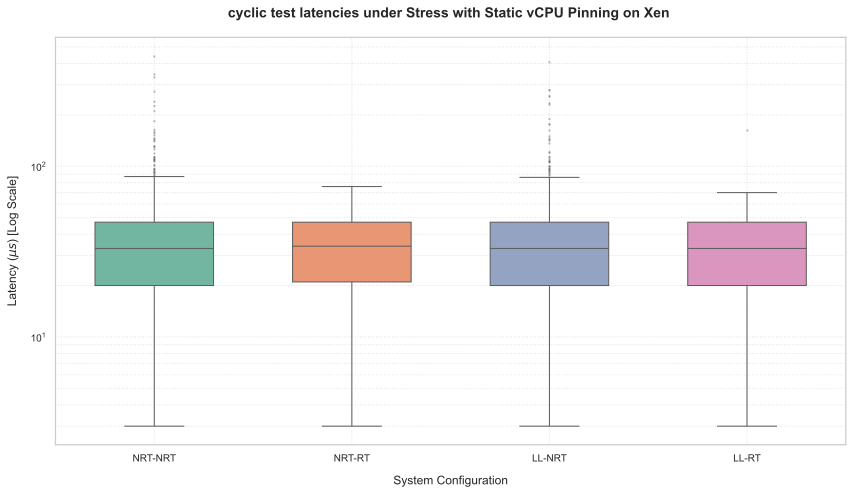

## SUMMARY OF RESULTS

Following the detailed analysis of each individual scenario, the table below provides a consolidated overview of the Worst-Case Execution Time (WCET) measurements. It allows for a direct comparison across all four Dom0-DomU kernel configurations (**NRT-NRT**, **NRT-RT**, **LL-NRT**, and **LL-RT**) under the four tested scheduling and load conditions: standard dynamic execution (**BASELINE**), execution under heavy system load within Dom0 (**STRESS WORKLOAD**), execution with static core isolation (**vCPU PINNING BASELINE**), and isolated execution under heavy load (**vCPU PINNING STRESS WORKLOAD**).

| Configuration | NRT-NRT | NRT-RT | LL-NRT | LL-RT |
|---|---|---|---|---|
| **BASELINE** | 369 | 74 | 152 | 71 |
| **STRESS WORKLOAD** | 239 | 177 | 526 | 209 |
| **vCPU PINNING BASELINE** | 137 | 67 | 179 | 65 |
| **vCPU PINNING STRESS WORKLOAD** | 443 | 76 | 410 | 163 |

Furthermore, alongside the consolidated WCET table, this section presents a detailed breakdown of the percentage increments for both the maximum latency (WCET) and the average latency (expressed as Mean $\pm$ Standard Deviation). To comprehensively evaluate the effectiveness of the hardware isolation mechanisms, this quantitative analysis of the performance degradation is divided into two distinct sets: the first evaluates the impact of the Dom0 stress workload under standard dynamic scheduling, while the second analyzes the impact of the same stress workload when strict static vCPU pinning is applied to isolate the domains.

### NRT NRT

| METRIC | BASELINE | STRESS WORKLOAD |
| :--- | :--- | :--- |
| **Average ± SD** | 32.87 ± 15.17 µs | 35.52 ± 15.50 µs |
| **WCET (Max)** | 369 µs | 239 µs |

**PERCENTAGE INCREMENTS (Stress vs. Baseline):**
* Average Increment: +8.06%
* WCET Increment: -35.23%


### NRT RT

| METRIC | BASELINE | STRESS WORKLOAD |
| :--- | :--- | :--- |
| **Average ± SD** | 33.20 ± 15.12 µs | 35.86 ± 15.54 µs |
| **WCET (Max)** | 74 µs | 177 µs |

**PERCENTAGE INCREMENTS (Stress vs. Baseline):**
* Average Increment: +8.01%
* WCET Increment: +139.19%


### LL NRT

| METRIC | BASELINE | STRESS WORKLOAD |
| :--- | :--- | :--- |
| **Average ± SD** | 32.71 ± 15.17 µs | 35.58 ± 15.55 µs |
| **WCET (Max)** | 152 µs | 526 µs |

**PERCENTAGE INCREMENTS (Stress vs. Baseline):**
* Average Increment: +8.79%
* WCET Increment: +246.05%


### LL RT

| METRIC | BASELINE | STRESS WORKLOAD |
| :--- | :--- | :--- |
| **Average ± SD** | 32.89 ± 15.14 µs | 35.66 ± 15.60 µs |
| **WCET (Max)** | 71 µs | 209 µs |

**PERCENTAGE INCREMENTS (Stress vs. Baseline):**
* Average Increment: +8.42%
* WCET Increment: +194.37%

---

### NRT NRT

| METRIC | vCPU PINNING BASELINE | vCPU PINNING STRESS WORKLOAD |
| :--- | :--- | :--- |
| **Average ± SD** | 32.65 ± 15.17 µs | 32.76 ± 15.10 µs |
| **WCET (Max)** | 137 µs | 443 µs |

**PERCENTAGE INCREMENTS (Stress vs. Baseline):**
* Average Increment: +0.34%
* WCET Increment: +223.36%


### NRT RT

| METRIC | vCPU PINNING BASELINE | vCPU PINNING STRESS WORKLOAD |
| :--- | :--- | :--- |
| **Average ± SD** | 32.59 ± 15.16 µs | 33.23 ± 15.09 µs |
| **WCET (Max)** | 67 µs | 76 µs |

**PERCENTAGE INCREMENTS (Stress vs. Baseline):**
* Average Increment: +1.96%
* WCET Increment: +13.43%

### LL NRT

| METRIC | vCPU PINNING BASELINE | vCPU PINNING STRESS WORKLOAD |
| :--- | :--- | :--- |
| **Average ± SD** | 32.49 ± 15.19 µs | 32.83 ± 15.06 µs |
| **WCET (Max)** | 179 µs | 410 µs |

**PERCENTAGE INCREMENTS (Stress vs. Baseline):**
* Average Increment: +1.05%
* WCET Increment: +129.05%


### LL RT

| METRIC | vCPU PINNING BASELINE | vCPU PINNING STRESS WORKLOAD |
| :--- | :--- | :--- |
| **Average ± SD** | 33.09 ± 15.18 µs | 32.73 ± 15.09 µs |
| **WCET (Max)** | 65 µs | 163 µs |

**PERCENTAGE INCREMENTS (Stress vs. Baseline):**
* Average Increment: -1.11%
* WCET Increment: +150.77%

## ANALYSIS OF DEVICE MODEL PRIORITY INVERSION IN MODERN XEN

In earlier research evaluating the real-time capabilities of hypervisors, a notable priority inversion issue was identified within the Xen architecture. The problem stems from the architectural dependency of Hardware Virtual Machine (HVM) guests on the Device Model. In Xen, when creating an HVM guest that requires a Device Model, this model is typically an instance of QEMU that executes as a standard process inside Domain 0 (Dom0). Because Dom0 is scheduled alongside other virtual machines by the hypervisor, a low-privilege QEMU process on Dom0 could be preempted when Dom0 is placed under heavy computational stress. Consequently, a Real-Time (RT) DomU waiting for the QEMU Device Model could suffer from unbounded latency, compromising its real-time execution guarantees.

To investigate whether this architectural bottleneck persists in modern versions of Xen, a series of experiments were conducted. The objective is to determine if elevating the QEMU process to a maximum Real-Time priority (FIFO scheduler with priority 99) mitigates preemption and improves the latency bounds of the DomU compared to the default Xen configuration.

To reproduce and analyze the aforementioned priority inversion on a modern Xen version, the environment was configured with strict resource partitioning.

* **CPU Pinning**: Dom0 was pinned to the first 22 physical CPUs (pCPUs), while the Hardware Virtual Machine (HVM) DomU was pinned to the last 2 pCPUs.
* **Host Stress**: To simulate heavy load and induce potential starvation in Dom0, stress-ng was executed with the following parameters:
  ```bash
  stress-ng --cpu 22 --vm 12 --vm-bytes 2G --timeout 10m
  ```
* **Kernel Configurations**: Tests were run across the usual four permutations of Dom0 and DomU kernels.
* **QEMU Priority Mitigation**: For each kernel combination, a baseline test (default QEMU priority) was compared against a mitigated test (`maxprioqemu`), wherein the QEMU Device Model process in Dom0 was explicitly set to the `SCHED_FIFO` policy with a priority of 99.

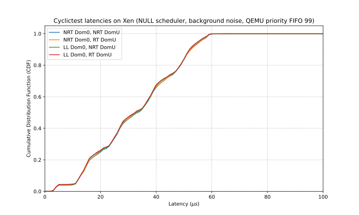

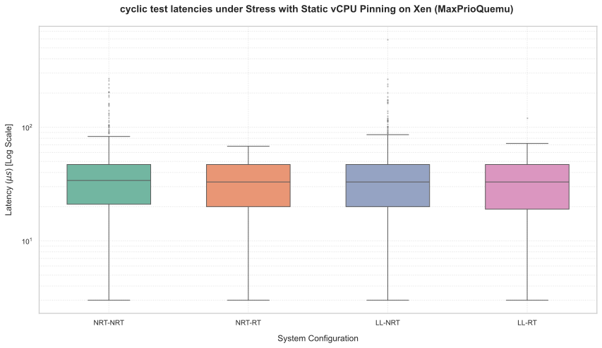

### Empirical Results

A thorough data analysis of the provided cyclictest histograms reveals the following key findings:

* **Absence of Priority Inversion Spikes**: In older versions of Xen suffering from the QEMU starvation issue, the expected symptom would be a pronounced "heavy tail" in the histogram, indicating extreme, unbounded latencies where the DomU was blocked waiting for Dom0. The empirical data across all results_null_hvm_pinned_* logs demonstrates no such extreme outliers in the default priority configurations.
* **Latency Distribution Parity**: The latency distributions between the default configurations and their mitigated counterparts are virtually identical.
* **Consistent Upper Bounds**: The maximum recorded latencies (Worst-Case Execution Time) in the standard configurations are directly comparable to those in the maximum priority configurations. Across both the Low-Latency (LL) and Non-Real-Time (NRT) Dom0 environments, elevating QEMU's priority did not tighten the worst-case temporal bounds.

Based on the experimental data, the priority inversion problem previously documented in Section 6.2 of the Abeni and Faggioli research seems to be non-existent in this modern Xen deployment. Changing the Device Model priority yields no beneficial effect for the latency bounds of real-time tasks inside the DomU.

With further experiments, we confirmed that changing the priority of the QEMU process does not improve latency even when using the Credit2 scheduler.

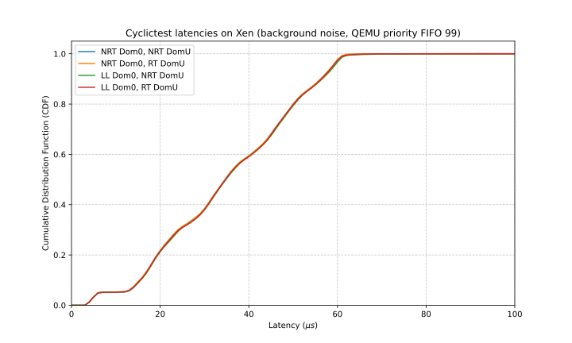

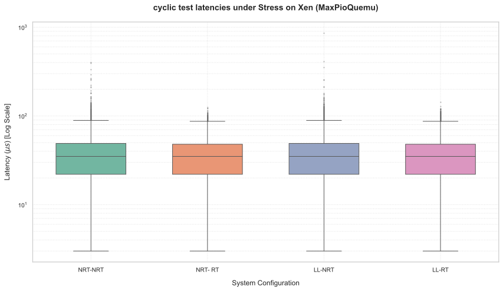

This behavior indicates that modern Xen HVM implementations successfully decouple essential local timer and interrupt deliveries from the QEMU Device Model. Because CPU-bound real-time workloads (like cyclictest) primarily exercise timer wakeups rather than complex I/O, the DomU can accurately maintain its temporal constraints utilizing hardware virtualization extensions alone. Therefore, manually elevating the priority of the Dom0 QEMU process is unnecessary for maintaining real-time determinism in contemporary Xen environments.

## IMPACT OF DIFFERENT STRESSORS ON LATENCIES

Following the previous tests, it was decided to conduct a new case study: the latter aims to measure and compare the real-time latency perceived by an application workload running inside HVM virtual machines (DomU) on a Xen hypervisor, as four experimental factors vary:

* **Dom0 Kernel**: standard ("NRT") vs. low-latency/PREEMPT_RT kernel ("LL");
* **vCPU Pinning**: guests with vCPUs pinned to dedicated physical cores vs. unpinned guests (free scheduling by Xen);
* **Guest Type**: guest with standard Linux kernel ("nrt") vs. guest with RT kernel ("rt5");
* **Concurrent stress workload on Dom0**: no additional stressor besides CPU+memory ("baseline"), cache stress ("cache"), interrupts stress ("interrupts"), raw sockets stress ("rawsock").

The combination of these four factors generates 32 test scenarios.

The tests were executed via a bash orchestration script that, for each Dom0 kernel, sequentially boots (via grub-reboot) and subsequently instantiates the relevant guests. For each guest × stressor combination, the script:

* starts the "always-on" stressors on Dom0 (`stress-ng --cpu 22`, `stress-ng --vm 12 --vm-bytes 2G`), kept active for the entire duration of the guest's test block;
* starts the specific sequential stressor of the scenario (none for baseline; `--cache 0`; `--interrupts`; `--rawsock 22`);
* creates the DomU (`xl create`), waits 30 s for settling;
* runs `cyclictest` inside the DomU (priority 99, interval 50 µs, duration 5 minutes, histogram with a 1000 µs threshold) routing the output exclusively to a file to avoid introducing artifacts due to traffic on the serial console;
* destroys the DomU, mounts its disk on Dom0 to retrieve the histogram file, terminates all stressors, and clears the Dom0 caches before the next scenario.

Each kernel × guest × stressor combination was executed in a single run (no repetitions).

#### Metrics extracted from each log

* **Avg**: average scheduling latency (µs) over the entire run;
* **Max**: maximum observed latency (µs);
* **Overflow**: number of samples exceeding the histogram threshold (1000 µs) --- a direct indicator of severe latency events, not captured in the main distribution;
* **Overflow cycles**: the cycle indices in which the overflows occurred, useful to understand whether the events are concentrated in a phase of the test (e.g., startup or shutdown) or evenly distributed.

### Results

The following table reports the extracted metrics for each of the 32 combinations.

| **Kernel** | **Pinning** | **Guest**   | **Stressor** | **Avg (µs)** | **Max (µs)** | **Overflow** | **Note** |
|------------|-------------|-------------|--------------|--------------|--------------|--------------|----------|
| LL         | No          | nrt-hvm     | baseline     | 36           | 57.384       | 17           |          |
| LL         | No          | nrt-hvm     | cache        | 36           | 2774         | 1            |          |
| LL         | No          | nrt-hvm     | interrupts   | 36           | 59.998       | 18           |          |
| LL         | No          | nrt-hvm     | rawsock      | 35           | 52.363       | 13           |          |
| LL         | No          | rt5-hvm     | baseline     | 36           | 192          | 0            |          |
| LL         | No          | rt5-hvm     | cache        | 36           | 2772         | 19           | Isolated anomaly |
| LL         | No          | rt5-hvm     | interrupts   | 35           | 144          | 0            |          |
| LL         | No          | rt5-hvm     | rawsock      | 35           | 162          | 0            |          |
| LL         | Yes         | nrt-pinned  | baseline     | 32           | 470          | 0            |          |
| LL         | Yes         | nrt-pinned  | cache        | 34           | 35.984       | 1            | Single Overflow, start run |
| LL         | Yes         | nrt-pinned  | interrupts   | 32           | 423          | 0            |          |
| LL         | Yes         | nrt-pinned  | rawsock      | 32           | 536          | 0            |          |
| LL         | Yes         | rt5-pinned  | baseline     | 34           | 79           | 0            |          |
| LL         | Yes         | rt5-pinned  | cache        | 33           | 146          | 0            |          |
| LL         | Yes         | rt5-pinned  | interrupts   | 32           | 81           | 0            |          |
| LL         | Yes         | rt5-pinned  | rawsock      | 32           | 77           | 0            |          |
| NRT        | No          | nrt-hvm     | baseline     | 35           | 392          | 0            |          |
| NRT        | No          | nrt-hvm     | cache        | 36           | **61.611**   | **88**       | **Worst case** |
| NRT        | No          | nrt-hvm     | interrupts   | 35           | 61.826       | 12           |          |
| NRT        | No          | nrt-hvm     | rawsock      | 35           | 58.344       | 11           |          |
| NRT        | No          | rt5-hvm     | baseline     | 35           | 175          | 0            |          |
| NRT        | No          | rt5-hvm     | cache        | 36           | 244          | 0            |          |
| NRT        | No          | rt5-hvm     | interrupts   | 35           | 189          | 0            |          |
| NRT        | No          | rt5-hvm     | rawsock      | 35           | 143          | 0            |          |
| NRT        | Yes         | nrt-pinned  | baseline     | 32           | 450          | 0            |          |
| NRT        | Ys          | nrt-pinned  | cache        | 33           | 414          | 0            |          |
| NRT        | Yes         | nrt-pinned  | interrupts   | 32           | **4225**     | **47**       | Cluster overflow at end of run |
| NRT        | Yes         | nrt-pinned  | rawsock      | 32           | 236          | 0            |          |
| NRT        | Yes         | rt5-pinned  | baseline     | 32           | 72           | 0            |          |
| NRT        | Yes         | rt5-pinned  | cache        | 34           | 99           | 0            |          |
| NRT        | Yes         | rt5-pinned  | interrupts   | 33           | 80           | 0            |          |
| NRT        | Yes         | rt5-pinned  | rawsock      | 33           | 357          | 0            |          |

#### Summary by pinning effect

Aggregating all runs (regardless of kernel, guest, and stressor) by the "pinning" variable alone, the effect is clear:

| **Configuration** | **Avg mean latency (µs)** | **Max worst latency (µs)** | **Total overflows** | **Runs with overflow >0** |
| --- | --- | --- | --- | --- |
| Pinned guests (LL+NRT) | 32.6 | 35.984 | 48 | 2 / 15 |
| Unpinned guests (LL+NRT) | 35.4 | 61.826 | 179 | 8 / 16 |

vCPU pinning reduces both the mean latency (by about 3-4 µs) and, above all, the frequency and magnitude of overflow events. Almost all the overflows observed in the study come from unpinned runs.

### 1- vCPU pinning is the dominant factor

Across all tested combinations, the configurations with active pinning show an almost deterministic behavior: maximum latency almost always below 550 µs and zero overflows, with only [two isolated exceptions](#4--isolated-anomalies-not-reproducible-between-kernels). This result is independent of the Dom0 kernel (LL or NRT) and the guest type: the benefit therefore derives primarily from the isolation of scheduling resources, rather than from the low-latency kernel itself.

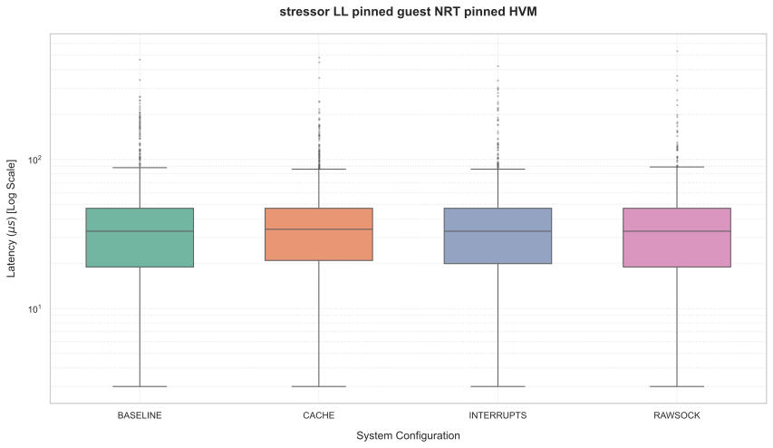

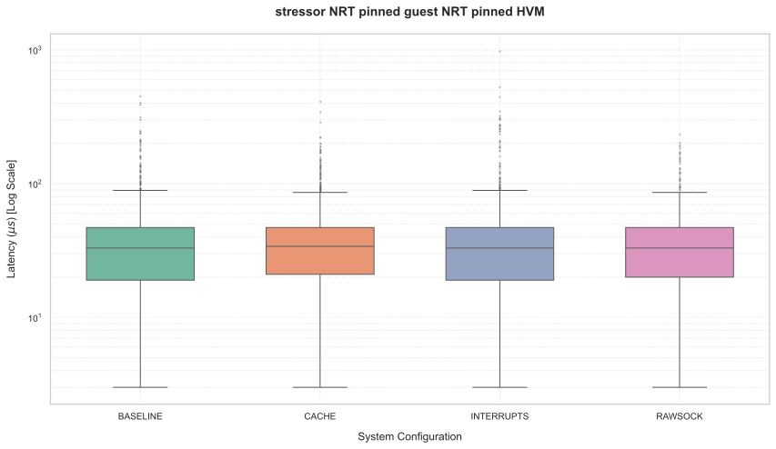

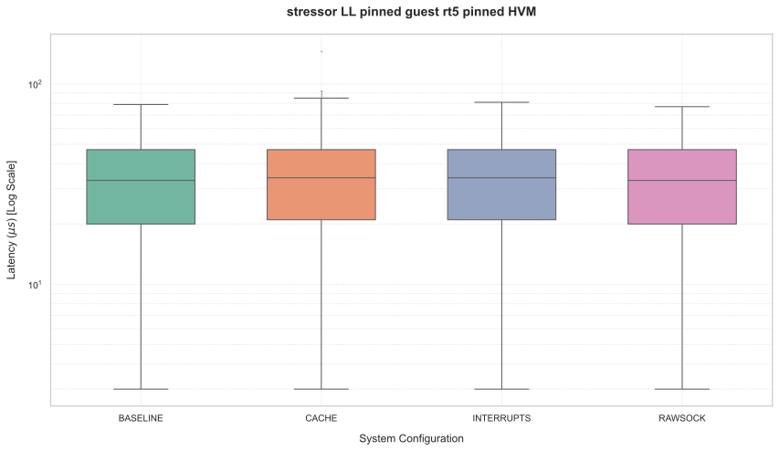

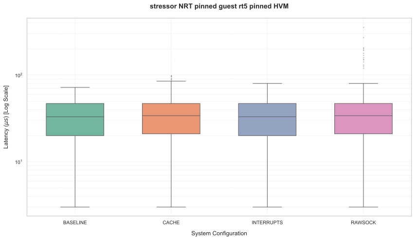

### 2- The unpinned "nrt-hvm" guest is the most fragile configuration in the dataset

Regardless of the Dom0 kernel used (LL or NRT), the unpinned nrt-hvm guest shows maximum latencies in the order of tens of milliseconds under the interrupts and rawsock stressors (up to ~62 ms), with 11-18 overflow events. The absolute worst case in the whole study is NRT + nrt-hvm + cache, with 88 overflows out of a total of ~4.78 million cycles and a maximum latency of 61.6 ms.

The fact that the problem occurs with both Dom0 kernels indicates that the cause is not primarily related to the low-latency kernel, but more likely to the configuration itself of the nrt-hvm guest domain (e.g., lack of vCPU isolation/affinity, scheduling weight in Xen).


### 3- The "rt5" guest is systematically more stable than the "nrt" guest, whether pinned or not

Given the same stressor and kernel, the rt5-hvm guest almost always shows maximum latencies in the order of hundreds of microseconds and zero overflows, even without pinning --- a significantly better behavior compared to its nrt-hvm twin under the same conditions. The only notable exception is described in the following point.

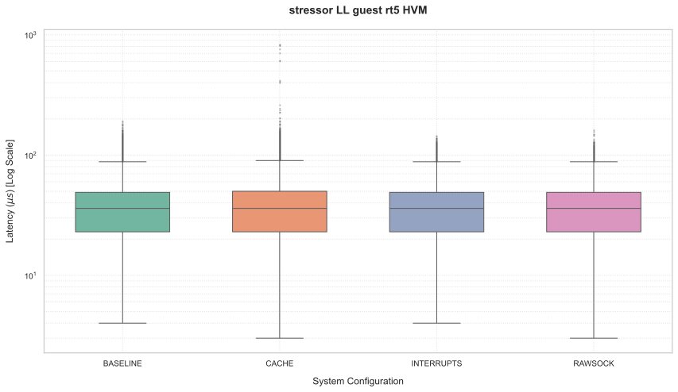

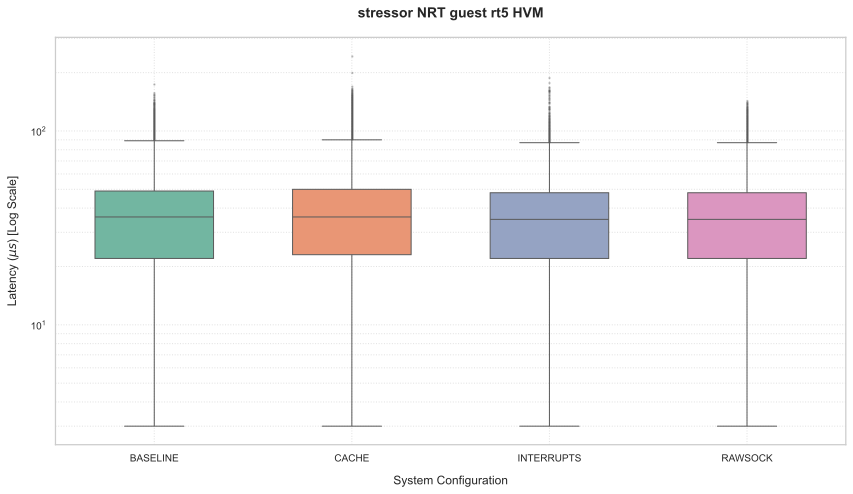

### 4- Isolated anomalies, not reproducible between kernels

The study detected three anomalous events that deviate from the otherwise clean behavior of their respective categories:

* **LL, rt5-hvm guest, cache stressor**: 19 overflows and max 2.77 ms, while the same guest under all other stressors (including the same cache stressor but with the NRT kernel) remains clean (0 overflows). It seems to be a specific interaction between the LL kernel and cache stress when the rt5 guest is active.
* **LL-pinned, nrt-pinned guest, cache stressor**: single isolated overflow at 35.98 ms, which occurred very early in the run (cycle 913 out of a total of ~4.93 million). The rest of the run is clean (secondary max ~536 µs in the other pinned conditions).
* **NRT-pinned, nrt-pinned guest, interrupts stressor**: 47 overflows, but all concentrated in a dense cluster right in the last ~3% of the run's cycles (close to the end of the 5 minutes), not distributed throughout the test.

The fact that these three events do not have a counterpart in the same guest × stressor combination tested with the other kernel suggests that they are events tied to a single run (experimental noise, test startup/shutdown phase, transient host interference) rather than a systemic and reproducible behavior of the low-latency kernel. It is not possible, with the current data, to distinguish with certainty between the two hypotheses (see point 6).

### 5- The "cache" stressor is the one with the most unpredictable impact

The cache stressor produces the most extreme result of the entire study (88 overflows with NRT kernel) but, in the same guest/kernel combination with active pinning, it turns out to be harmless instead (0 overflows). It is also the only stressor involved in [all three isolated anomalies](#4-isolated-anomalies-not-reproducible-between-kernels). Compared to interrupts and rawsock, which show a more uniform and predictable impact on the unpinned nrt-hvm guest, cache appears to be the stressor with the highest behavioral variance among the tested conditions.

### 6- Kernel LL vs NRT difference: no clear winner on unpinned guests

Comparing LL and NRT on the same unpinned guest/stressor combination, no kernel emerges as systematically better than the other. For example, on the nrt-hvm guest with cache stressor, LL reports 1 overflow (max 2.77 ms) against the 88 overflows of NRT (max 61.6 ms) --- a result clearly in favor of LL. But on the rt5-hvm guest with the same cache stressor, NRT is clean (0 overflows) while LL reports 19 overflows. This crossed pattern indicates that the kernel × guest × stressor interaction is more complex than a simple "the low-latency kernel always reduces latency", and that the benefit of the PREEMPT_RT kernel in this setup is, given the current state of the data, less decisive than vCPU pinning.

### Final considerations

* The factor that influences latency quality more than any other is **vCPU pinning**: almost zero overflows on all pinned configurations, regardless of kernel and stressor.
* The **rt5-hvm** guest performs better than the **nrt-hvm** guest in every tested condition, pinning aside.
* The **unpinned nrt-hvm** guest is unreliable under load (except in the baseline scenario), with peaks up to ~62 ms regardless of the Dom0 kernel.
* The **low-latency (LL/PREEMPT_RT)** kernel does not guarantee, in this dataset, a systematic improvement compared to the standard kernel (NRT): direct comparison shows crossed results depending on the guest/stressor combination.
* The **cache** stressor is the one that generates the greatest variability in results, including the absolute worst case of the study and all three isolated anomalies detected.

## IMPACT OF A NOISY DOMU

The study aims to evaluate the impact of a disturbance workload ("noisy neighbor") generated by a dedicated DomU on a second DomU subjected to real-time latency measurement (cyclictest), comparing four configurations of the Dom0 (standard kernel vs. low-latency rt5-ll kernel, with and without vCPU pinning) and, for each, two types of DomUs (non-RT kernel and RT rt5 kernel).

* **Dom0**: Xen 4.17-amd64 Type 1 hypervisor, 4 dedicated vCPUs, tested with two Linux kernels: 6.18.35 (standard, "NRT") and 6.18.35-rt5-ll (low-latency, "LL").
* For each Dom0 kernel, the tests were repeated with and without static pinning of the DomU vCPUs, for a total of 4 Dom0 configurations:
  * NRT-4vcpu
  * NRT-4vcpu-pinned
  * LL-4vcpu
  * LL-4vcpu-pinned


* **"Noisy" DomU**: a dedicated VM (ubuntu-24.04-linux-6.18.35-noisyguest-big), started before each test cycle and kept active for the entire duration of the tests on the current configuration. It generates load with two independent stress-ng processes:
  * 16 CPU workers (`--cpu 16`)
  * 16 memory workers of 1 GB each (`--vm 16 --vm-bytes 1G`)
  * both without timeout (continuous load).


* **"Regular" DomU** (under measurement): two variants for each Dom0 configuration:
  * DomU with non-RT kernel (guest-nrt-hvm)
  * DomU with RT rt5 kernel (guest-rt5-hvm)
  * in the pinned versions when applicable.


* **Measurement**: cyclictest executed inside the regular DomU with `--mlockall`, priority 99, 1 thread, affinity 1, interval 50 µs, duration 5 minutes, histogram up to 1000 µs.
* Each kernel-DomU combination was executed only once (no statistical repetition) .


The entire flow is orchestrated by a bash script (`cyclictest_noisy_domu.sh`) which, for each of the 4 kernel configurations:

* reboots the Dom0 onto the target kernel via grub-reboot,
* starts the noisy DomU and launches stress-ng on it,
* then sequentially starts the two regular DomUs,
* executes cyclictest on each,
* retrieves their histogram and destroys the VM before moving to the next.

At the end of the two DomUs, the noisy DomU is destroyed and the process moves to the next kernel configuration. Before each run, the Dom0 caches are cleared (`drop_caches`) to reduce residual caching effects between tests.

The result of the campaign is a set of 8 histogram files (4 kernel configurations × 2 DomU types), each with the complete latency distribution, min/avg/max, overflow count, and cycles in which they occurred.

## Collected data

The following table summarizes the values extracted from the footer of each histogram. Highlighted (bold) is the only test with overflows and maximum values out of scale compared to all the others.

| **Dom0 kernel config.** | **Pinning** | **DomU / DomU kernel** | **Avg (µs)** | **Max (µs)** | **Overflow** | **Samples** |
| --- | --- | --- | --- | --- | --- | --- |
| NRT-4vcpu | No | guest-nrt-hvm (non-RT) | 33 | **62566** | **4** | 5,003,768 |
| NRT-4vcpu | No | guest-rt5-hvm (RT) | 36 | 312 | 0 | 4,807,301 |
| NRT-4vcpu | Yes | guest-nrt-pinned-hvm (non-RT) | 33 | 336 | 0 | 5,041,620 |
| NRT-4vcpu | Yes | guest-rt5-pinned-hvm (RT) | 33 | 87 | 0 | 5,061,753 |
| LL-4vcpu (rt5-ll) | No | guest-nrt-hvm (non-RT) | 32 | 167 | 0 | 5,085,072 |
| LL-4vcpu (rt5-ll) | No | guest-rt5-hvm (RT) | 32 | 74 | 0 | 5,098,348 |
| LL-4vcpu (rt5-ll) | Yes | guest-nrt-pinned-hvm (non-RT) | 33 | 502 | 0 | 5,052,370 |
| LL-4vcpu (rt5-ll) | Yes | guest-rt5-pinned-hvm (RT) | 33 | 123 | 0 | 5,035,559 |

*In all 8 tests, the minimum recorded latency is 3 µs, a stable and consistent value regardless of kernel, pinning, or DomU --- indicating that the "idle" path (no interference) is not influenced by the noisy neighbor, unlike the tail of the distribution.*


### 1- Only one critical case out of eight

The combination **NRT-4vcpu (Dom0 without RT patch) + no pinning + non-RT DomU** is the only one to present a truly critical behavior: maximum latency of 62,566 µs (~62.5 ms) and 4 histogram overflows, recorded at cycles 8,323, 20,698, 24,840, and 37,984. All other 7 configurations remain under a millisecond of maximum latency and at zero overflows. It is also the only test with a significantly lower number of samples than the others (4.81M against the expected 5.0-5.1M in 5 minutes at a 50 µs interval), consistent with lost/delayed cycles during spikes.

### 2- vCPU pinning effect

Pinning has a very marked impact only in the absence of an RT kernel on Dom0: on the NRT-4vcpu configuration, it completely eliminates the catastrophic outlier (max 62,566 → 336 µs on the non-RT DomU; 312 → 87 µs on the RT DomU) and zeros out the overflows. On the LL kernel, instead, the effect is opposite and more contained: pinning slightly increases the maximums compared to the same test without pinning (non-RT DomU: 167 → 502 µs; RT DomU: 74 → 123 µs), while remaining orders of magnitude below the critical threshold observed on NRT.

### 3- DomU kernel effect (RT rt5 vs non-RT)

With the same Dom0 configuration, the DomU with the RT rt5 kernel almost always shows a shorter latency tail compared to its non-RT twin:

* NRT-4vcpu (62,566 → 312 µs)
* NRT-4vcpu-pinned (336 → 87 µs)
* LL-4vcpu (167 → 74 µs)

Even in LL-4vcpu-pinned, the RT DomU remains better (502 → 123 µs), although both values are higher than the unpinned variant of the same Dom0 kernel.


### 4- RT kernel on Dom0 and RT kernel on DomU: overlapping benefits

The two mechanisms (low-latency kernel on Dom0, RT kernel on DomU) act in the same direction and partially overlap: any LL-4vcpu configuration, with or without pinning, always stays within a few hundred µs of maximum, regardless of the DomU. It is the total absence of both protections --- no RT kernel on either the Dom0 or the DomU, no pinning --- that produces the only truly out-of-scale result of the campaign.

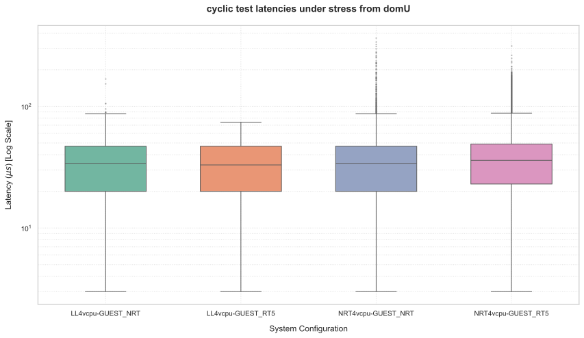

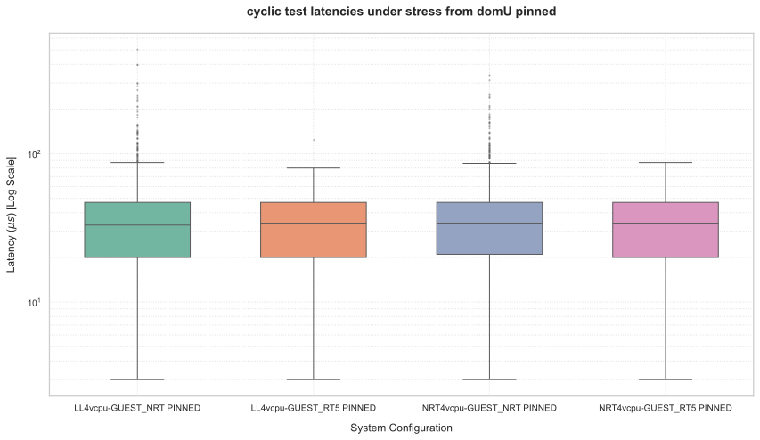

## Conclusions

* The concrete risk introduced by the noisy neighbor (CPU+memory stress-ng) manifests severely only in the configuration devoid of any mitigation (non-RT Dom0, no pinning, non-RT DomU): all other tested combinations keep the maximum latency under a millisecond.
* **vCPU pinning** is the most effective and economical countermeasure when an RT-patched kernel is not available on Dom0: on its own, it brings the maximum latency down from 62.5 ms to a few hundred µs.
* A **low-latency kernel on Dom0 (rt5-ll)** inherently guarantees stable behavior regardless of pinning, suggesting that, having such a kernel, static pinning is not strictly necessary merely for robustness against the noisy neighbor.
* An **RT kernel on the DomU** systematically reduces the latency tail compared to the non-RT kernel, under the same Dom0 conditions, confirming that the two levers (Dom0 and DomU) are complementary and not alternatives.

## TACLe BENCHMARK

This section of the documentation illustrates the rationale behind the selection of the benchmarks extracted from the **TACLeBench** version 1.9 suite and the methodology adopted for their execution within our architecture. The goal is to provide a heterogeneous workload to accurately validate execution latencies and performance stability in environments with strict real-time requirements.

### 1. Benchmark Selection

We selected a representative program for each of the main TACLeBench categories, ensuring optimal coverage of the different execution patterns.

* **Kernel Benchmark (`matrix1`):** Isolates the most computationally intensive portions of code to evaluate raw CPU performance and cache efficiency.
* **Sequential Benchmark (`huff_enc`):** Evaluates sequential processing and memory access patterns. Data compression (325 SLOC, David Bourgin) is excellent for measuring latency variations in single-threaded execution.
* **Test Benchmark (`test3`):** An artificial stress test for WCET (Worst-Case Execution Time, 4235 SLOC, Universität des Saarlandes) analysis. It pushes the execution engine to its limits to measure time safety margins and system robustness.
* **Parallel Benchmark (`Debie`):** Aerospace observation tool (6615 SLOC, Tidorum Ltd) consisting of 8 tasks. Essential for testing synchronization mechanisms and preemption in multi-tasking scenarios.
* **Application Benchmark (`lift`):** An elevator controller (361 SLOC, Martin Schoeberl). Verifies that the latency metrics from synthetic tests guarantee stability in a real cyber-physical control application.

### 2. Execution Methodology and Test Scenarios

To rigorously analyze the system's behavior and the impact of the virtualization architecture, **all 5 selected benchmarks were executed on the LL-RT (Low-Latency Dom0, Real-Time DomU) configuration**.

For each benchmark, we defined a test matrix composed of four operational scenarios. In all baseline configurations, **4 vCPUs were assigned to Dom0**. The analyzed variables concern the introduction of a stress load (noise) of varying size originating from another DomU and the application of vCPU pinning (crucial for avoiding context migrations and stabilizing latencies).

To ensure strict real-time conditions and accurate latency measurements, the execution procedure was carefully standardized across all test scenarios. The process involved specific compilation flags, scheduler modifications, and rigid execution parameters designed to eliminate typical operating system interference.

**Compilation and Preparation**
Each of the benchmarks were modified to support automatically changing scheduling priority and repeated executions (the source code is available in this repository). We then compiled them using `-O2` optimizations and linked with the necessary POSIX real-time and threading libraries:

```bash
gcc -O2 -o test3 test3.c -lpthread -lrt

```

**Benchmark Execution Parameters**
The TACLe benchmarks were executed via the command line with a strict set of arguments to maintain deterministic behavior. The fundamental flags applied across the tests included:

* `--mlockall`: Locks the process's memory pages directly into RAM, preventing any unpredictable latency spikes caused by page faults or disk swapping.
* `--priority=99`: Enforces the highest real-time priority internally for the benchmark's execution thread.
* `--affinity=1`: Applies CPU pinning, locking the execution strictly to CPU core 1. This is a critical step to prevent costly context migrations across different processor cores.

Below are the exact execution commands utilized for the targeted benchmarks:

```bash
# Executing test3 (pseudo-cyclictest) for 10,000 loops and outputting a latency histogram
sudo ./test3 --mlockall --priority=99 --affinity=1 --loops=10000 --histogram=1000000 --histfile=results/results_test3_baseline.log
```

**Noise Generation Strategy**
To evaluate the architectural robustness and jitter expansion during the noisy scenarios, interference was artificially injected into the system. This was achieved using `stress-ng` to spawn multiple aggressive workers, intentionally taxing the CPU cores and the virtual memory subsystem to simulate severe cache thrashing and scheduling pressure:

```bash
stress-ng --cpu 16 --vm 16 --vm-bytes 1G --timeout 10m

```

**Domain configuration**
To clearly understand the extent of the interference of a different DomU stress workload on the critical guest, we designed two test scenarios:

* **Small Noise**: a small DomU with just 2 vCPUs and 4 GB of RAM. This would introduce a small amount of noise, thus testing if at least some isolation is provided.
* **Big Noise**: a more beefy DomU configuration with 16 vCPUs and 16 GB of RAM. In this case, the interference introduced is more severe, pushing the limits of the isolation mechanism.
* **Big Noise with pinning**: the same of the previous setup but with added static vCPU pinning. This would determine how much the scheduling algorithm affects the isolation of the domains.

### TACLeBench Baseline Execution Analysis

Establishing this baseline is a critical first step for comparing the determinism and worst-case execution time (WCET) latencies, a Type 1 hypervisor utilizing Dom0 and DomU architectures. The following analysis evaluates the raw execution logs to quantify system determinism before introducing vCPU pinning.

#### Baseline Latency Summary

| Benchmark | Total Loops | Min Latency (μs) | Avg Latency (μs) | Max Latency (μs) | Absolute Jitter (Max - Min) |
| --- | --- | --- | --- | --- | --- |
| **DEBIE** | 10,000 | 23,921 | 27,175 | 31,048 | 7,127 μs |
| **huffenc** | 1,000,000 | 15 | 17 | 41 | 26 μs |
| **lift** | 1,000,000 | 19 | 24 | 254 | 235 μs |
| **matrix1** | 1,000,000 | 0 | 0 | 7 | 7 μs |
| **test3** | 10,000 | 8,286 | 8,328 | 8,414 | 128 μs |

#### Workload-Specific Behavior

**DEBIE**

* The DEBIE benchmark represents the heaviest and most unpredictable workload in the dataset, with a massive spread between the minimum (23,921 µs) and maximum (31,048 µs) execution times.
* The absolute jitter of over 7 milliseconds indicates significant preemption, cache misses, or scheduling overhead during execution.
* This high variability makes DEBIE an excellent candidate for stress-testing how well future DomU or virtualized configurations handle long-running, computationally complex real-time tasks.

**Huffenc**

* The `huffenc` benchmark represents a short-lived task executed 1,000,000 times.
* It shows excellent stability with an average latency of 17 µs and a worst-case peak of 41 µs.
* The absolute jitter is strictly bounded at 26 µs, derived from a minimum latency of 15 µs.

**Lift**

* The `lift` benchmark shows a moderate average latency of 24 µs, sitting noticeably above the minimum latency (19 µs) across one million loops.
* The maximum latency peak of 254 µs represents a significant outlier, yielding an absolute jitter of 235 µs.
* While the majority of executions cluster near 19-24 µs, this tail latency shows that even on the unisolated baseline scheduler, `lift` is subject to occasional severe delays.

**Matrix1**

* The `matrix1` execution is extremely lightweight, registering a 0 µs average latency, which indicates that standard execution times fall below the microsecond resolution threshold of the testing configuration.
* The absolute worst-case execution time caps at just 7 µs.
* Because this benchmark is practically instantaneous, it is almost entirely cache-bound and will be highly sensitive to hypervisor memory management disruptions.

**Test3**

* The `test3` benchmark represents a heavier execution profile containing 10,000 loops, an average latency of 8,328 µs, and a maximum of 8,414 µs.
* The tighter jitter (128 µs) relative to its extended execution time suggests a steady computational loop that is less affected by micro-interruptions compared to the highly variable DEBIE benchmark.

#### Real-Time Systems Assessment

This baseline demonstrates a standard, unisolated environment where lightweight tasks (`matrix1`, `huffenc`) execute with near-perfect determinism, while heavier tasks (`DEBIE`) suffer from severe scheduling jitter. `lift` also shows a notable outlier tail (235 µs jitter, 254 µs peak) despite a low average, indicating it is more exposed to occasional scheduling delays than its average-case behavior would suggest. The outliers observed in `lift` (254 µs) and `huffenc` (41 µs) are the specific OS noise artifacts that isolation mechanisms aim to eliminate. When transferring these workloads to virtualized setups, tracking the expansion of these maximum latency tails will directly quantify the scheduling interference introduced by the virtualization layer.

### TACLeBench Small Noise Execution Analysis

This phase of testing evaluates the determinism and worst-case execution time (WCET) latencies of KVM and Xen (a Type 1 hypervisor utilizing Dom0 and DomU architectures) under a "Small Noise" configuration. The following analysis interprets the execution logs to quantify how minor system disturbances impact the predictability of the hypervisor scheduling.

#### Small Noise Latency Summary

| Benchmark | Total Loops | Min Latency (μs) | Avg Latency (μs) | Max Latency (μs) | Absolute Jitter (Max - Min) |
| --- | --- | --- | --- | --- | --- |
| **DEBIE** | 10,000 | 23,873 | 27,118 | 31,022 | 7,149 μs |
| **huffenc** | 1,000,000 | 15 | 17 | 741 | 726 μs |
| **lift** | 1,000,000 | 19 | 20 | 43 | 24 μs |
| **matrix1** | 1,000,000 | 0 | 0 | 10 | 10 μs |
| **test3** | 10,000 | 8,286 | 8,331 | 8,885 | 599 μs |

#### Workload-Specific Behavior

**DEBIE**

* The DEBIE benchmark remains the heaviest workload, with execution times ranging from a minimum of 23,873 µs to a maximum of 31,022 µs.
* The absolute jitter sits at 7,149 µs, confirming its high sensitivity to preemption and scheduling overhead even in a small noise environment.

**Huffenc**

* The `huffenc` benchmark maintains a stable average latency of 17 µs across 1,000,000 iterations, close to its baseline behavior.
* However, the maximum latency spikes sharply to 741 µs — well above both the baseline (41 µs) and even the big noise scenario (445 µs) — producing an absolute jitter of 726 µs. This result has been confirmed directly against the raw execution logs: it is a genuine tail-latency event rather than a data or transcription error, and it stands out as the single largest WCET recorded for `huffenc` across every tested scenario, including heavier noise conditions.

**Lift**

* Under the small noise configuration, the `lift` benchmark exhibits improved determinism versus baseline, with an average latency of 20 µs.
* The maximum latency peak is 43 µs, representing a dramatically tighter jitter (24 µs) compared to the unisolated baseline's 235 µs.

**Matrix1**

* The `matrix1` execution remains extremely lightweight and cache-bound, registering a 0 µs average latency.
* The absolute worst-case execution time is capped at 10 µs.

**Test3**

* The `test3` benchmark executed 10,000 loops with an average latency of 8,331 µs.
* The maximum latency reached 8,885 µs, pushing the absolute jitter to 599 µs. The jitter expansion here is heavily influenced by specific micro-interruptions captured during the run.

#### Real-Time Systems Assessment

Evaluating the small noise scenario reveals that lightweight and highly repetitive tasks (`matrix1`, `lift`) can maintain extreme determinism, with jitter boundaries narrowing significantly (such as `lift` dropping to a 43 µs max peak from 254 µs at baseline). `huffenc`, however, produces a confirmed tail-latency outlier (741 µs WCET) under this "small" noise level — exceeding even its own big-noise worst case (445 µs) — a counterintuitive but log-verified result that highlights how a single rare preemption event can dominate the worst-case metric for short, high-frequency tasks, independent of the nominal "size" of the background noise. Heavier workloads like `DEBIE` continue to exhibit substantial variance.

### TACLeBench Big Noise Execution Analysis

This phase of the evaluation investigates the determinism and worst-case execution time (WCET) latencies of a Xen DomU in the presence of another, big-sized DomU affected by significant stress workload. The following analysis examines the execution logs to quantify how significant system disturbances and heavy background noise degrade the predictability of the scheduler prior to applying isolation techniques.

#### Big Noise Latency Summary

| Benchmark | Total Loops | Min Latency (μs) | Avg Latency (μs) | Max Latency (μs) | Absolute Jitter (Max - Min) |
| --- | --- | --- | --- | --- | --- |
| **DEBIE** | 10,000 | 24,627 | 28,196 | 57,314 | 32,687 μs |
| **huffenc** | 1,000,000 | 15 | 27 | 445 | 430 μs |
| **lift** | 1,000,000 | 17 | 38 | 1,000 | 983 μs |
| **matrix1** | 1,000,000 | 0 | 0 | 51 | 51 μs |
| **test3** | 10,000 | 8,287 | 9,182 | 14,786 | 6,499 μs |

#### Workload-Specific Behavior

**DEBIE**

* Under heavy noise, the DEBIE benchmark suffers massive scheduling disruptions, pushing the worst-case execution time to 57,314 µs.

* The absolute jitter explodes to 32,687 µs, meaning the variance in execution time is larger than the minimum latency itself (24,627 µs).

**Huffenc**

* Under heavy noise, the `huffenc` task's average latency rises to 27 µs (up from 17 µs at baseline, a +58.78% increase), and the maximum latency spikes to 445 µs — a **+987.19% increase in WCET** versus baseline, the largest percentage WCET degradation of any lightweight benchmark in this scenario.

* This results in an absolute jitter of 430 µs, confirming that even high-frequency, short-lived tasks are heavily preempted in a noisy environment.

**Lift**

* The `lift` benchmark's determinism collapses entirely under the big noise configuration, with the maximum latency spiking to 1,000 µs — a full millisecond, and nearly 4x the baseline's already-elevated 254 µs peak.

* The average latency also rises substantially to 38 µs (up from 24 µs at baseline, a +55.89% increase), and the absolute jitter of 983 µs confirms severe, sustained scheduling delays rather than an isolated outlier.

**Matrix1**

* Although the average latency remains at 0 µs due to the task's cache-bound, lightweight nature, the maximum latency expands to 51 µs.

* An absolute jitter of 51 µs on a task that typically executes instantaneously highlights severe micro-interruptions and cache thrashing induced by the noise.

**Test3**

* The `test3` benchmark registers an average latency of 9,182 µs and a severe worst-case peak of 14,786 µs.

* The absolute jitter jumps to 6,499 µs, derived from a minimum execution time of 8,287 µs, proving that medium-weight computational loops cannot maintain steady execution states when sharing unisolated CPU resources with heavy noise.

#### Real-Time Systems Assessment

The results of these tests effectively demonstrates the catastrophic loss of determinism across all workloads while the system is under stress because of another DomU. Even ultra-lightweight tasks like `matrix1`, `huffenc` and `lift` experience significant latency spikes — `lift` reaches a full millisecond of worst-case latency (1,000 µs), and `huffenc` shows the steepest relative WCET degradation of the suite (+987.19% versus baseline) — while heavy tasks like `DEBIE` become entirely unpredictable. This demostrates the ineffectiveness of the isolation boundaries of the native Xen architecture.

### TACLeBench Big Noise Pinned Execution Analysis

This phase of the evaluation investigates the determinism and worst-case execution time (WCET) latencies of a Xen DomU in the presence of another, big-sized DomU affected by significant stress workload. Because of the poor performance of the unpinned configuration, exhibiting excessively high latencies, CPU pinning was introduced to restrain the interference. The following analysis examines the execution logs to quantify how this pinning mitigates system disturbances.

#### Big Noise Pinned Latency Summary

| Benchmark | Total Loops | Min Latency (μs) | Avg Latency (μs) | Max Latency (μs) | Absolute Jitter (Max - Min) |
| --- | --- | --- | --- | --- | --- |
| **DEBIE** | 10,000 | 24,034 | 27,274 | 41,266 | 17,232 μs |
| **huffenc** | 1,000,000 | 15 | 17 | 41 | 26 μs |
| **lift** | 1,000,000 | 19 | 20 | 57 | 38 μs |
| **matrix1** | 1,000,000 | 0 | 0 | 11 | 11 μs |
| **test3** | 10,000 | 8,632 | 8,701 | 10,037 | 1,405 μs |

#### Workload-Specific Behavior

**DEBIE**

* The DEBIE benchmark ranges from a minimum of 24,034 µs to a maximum of 41,266 µs.
* Pinning the execution restrains the absolute jitter to 17,232 µs, which is a massive improvement over the unpinned big noise scenario, though it remains sensitive to preemption.

**Huffenc**

* The `huffenc` task executes with an average latency of 17 µs and a peak maximum latency of 41 µs, both back in line with baseline behavior.
* CPU pinning effectively bounds the absolute jitter at 26 µs, pulling the WCET down from 445 µs (unpinned Big Noise) — and dramatically down from the 741 µs outlier observed under Small Noise — back to baseline levels, restoring a high degree of stability to this lightweight loop.

**Lift**

* Under the pinned configuration, the `lift` benchmark regains much of its determinism, maintaining an average latency of 20 µs.
* The maximum latency reaches 57 µs, yielding an absolute jitter of 38 µs — dramatically reduced from the 983 µs jitter seen under unpinned big noise, though still above the small noise scenario's 24 µs.

**Matrix1**

* The `matrix1` execution is almost perfectly insulated by the pinning, maintaining a 0 µs average latency and an absolute worst-case execution time of just 11 µs.
* This 11 µs absolute jitter confirms that cache thrashing and severe scheduling interruptions are heavily mitigated.

**Test3**

* The `test3` benchmark registers an average latency of 8,701 µs and a worst-case peak of 10,037 µs.
* With an absolute jitter of 1,405 µs, this computational loop shows a massive recovery in predictability compared to the unpinned execution.

#### Real-Time Systems Assessment

The "Big Noise Pinned" baseline demonstrates the critical importance of CPU pinning when operating in highly congested environments. By binding tasks to specific cores, the hypervisor scheduler prevents the catastrophic latency spikes observed in the unpinned tests — `huffenc`'s WCET falls from 445 µs (and from the 741 µs Small Noise outlier) back to 41 µs, and `lift`'s WCET falls from 1,000 µs back to 57 µs once pinned. Lightweight tasks (`matrix1`, `lift`, `huffenc`) return to near-baseline determinism, and heavier workloads (`DEBIE`, `test3`) see their jitter margins compressed significantly.


### Max Latency Summary (μs)
To quickly evaluate system stability, the following table exclusively reports the peak values (**Max Latency**). This format allows for an at-a-glance comparison of the Worst-Case Execution Time across the four operational scenarios, directly highlighting the impact of noise and the effectiveness of CPU pinning in containing interference.

| Benchmark | Baseline | Small Noise | Big Noise | Big Noise Pinned |
| --- | --- | --- | --- | --- |
| **DEBIE** | 31,048 | 31,022 | 57,314 | 41,266 |
| **huffenc** | 41 | 741 | 445 | 41 |
| **lift** | 254 | 43 | 1,000 | 57 |
| **matrix1** | 7 | 10 | 51 | 11 |
| **test3** | 8,414 | 8,885 | 14,786 | 10,037 |

Furthermore, alongside the WCET summary, this section now includes a detailed breakdown of the percentage increments for both the average latency (expressed as Mean $\pm$ Standard Deviation) and the maximum latency (WCET). This addition provides a precise quantitative analysis of the performance degradation induced by the heavy background noise within the control domain (Dom0) compared to the baseline execution for each individual benchmark.

#### DEBIE

| METRIC | BASELINE | SMALL NOISE | BIG NOISE | BIG NOISE PINNED |
| :--- | :--- | :--- | :--- | :--- |
| **Average ± SD** | 27175.71 ± 1309.25 µs | 27118.01 ± 1312.34 µs | 28196.64 ± 3277.83 µs | 27274.32 ± 1328.13 µs |
| **WCET (Max)** | 31048 µs | 31022 µs | 57314 µs | 41266 µs |

**PERCENTAGE INCREMENTS (Stress vs. Baseline):**

* Average Increment: +3.76%
* WCET Increment: +84.60%

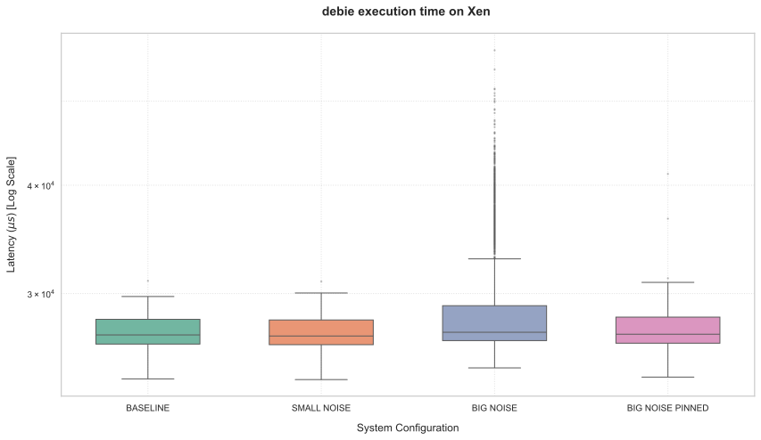

#### HUFFENC

| METRIC | BASELINE | SMALL NOISE | BIG NOISE | BIG NOISE PINNED |
| :--- | :--- | :--- | :--- | :--- |
| **Average ± SD** | 16756.76 ± 1304.86 ns | 16533.80 ± 1568.45 ns | 26606.56 ± 5118.09 ns | 16568.86 ± 1794.49 ns |
| **WCET (Max)** | 40959 ns | 740560 ns | 445304 ns | 41370 ns |

**PERCENTAGE INCREMENTS (Stress vs. Baseline):**

* Average Increment: ++58.78%
* WCET Increment: +987.19%

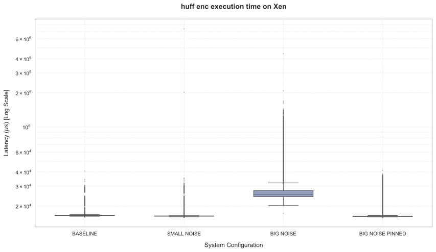

#### LIFT

| METRIC | BASELINE | SMALL NOISE | BIG NOISE | BIG NOISE PINNED |
| :--- | :--- | :--- | :--- | :--- |
| **Average ± SD** | 24464.53 ± 2225.55 ns | 20106.23 ± 1479.67 ns | 38136.97 ± 11983.88 ns | 20254.04 ± 2140.08 ns |
| **WCET (Max)** | 253587 ns | 43321 ns | 999941 ns | 57119 ns |

**PERCENTAGE INCREMENTS (Stress vs. Baseline):**

* Average Increment: +55.89%
* WCET Increment: +294.32%

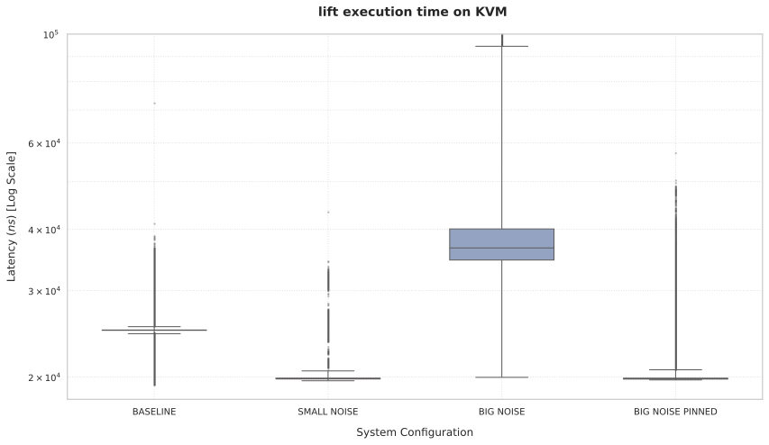

#### MATRIX1

| METRIC | BASELINE | SMALL NOISE | BIG NOISE | BIG NOISE PINNED |
| :--- | :--- | :--- | :--- | :--- |
| **Average ± SD** | 556.31 ± 154.19 ns | 557.07 ± 162.41 ns | 812.91 ± 437.85 ns | 545.04 ± 180.80 ns |
| **WCET (Max)** | 7470 ns | 9550 ns | 51259 ns | 11321 ns |

**PERCENTAGE INCREMENTS (Stress vs. Baseline):**

* Average Increment: +46.12%
* WCET Increment: +586.20%

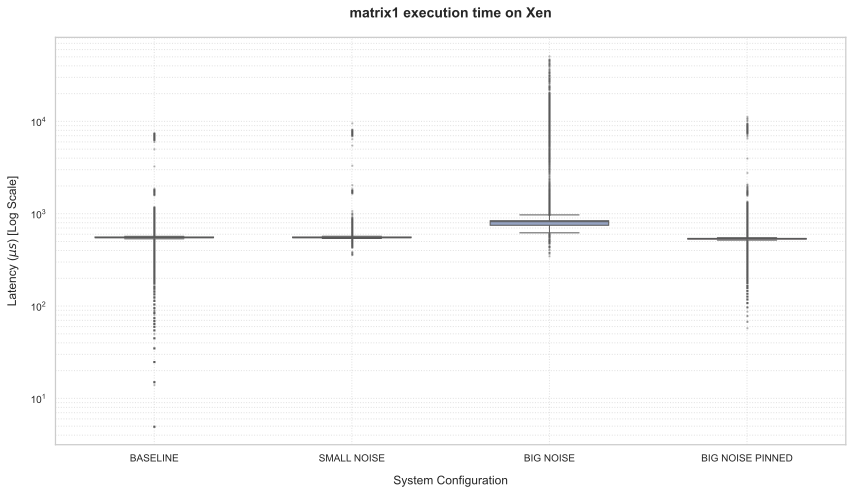

#### TEST3

| METRIC | BASELINE | SMALL NOISE | BIG NOISE | BIG NOISE PINNED |
| :--- | :--- | :--- | :--- | :--- |
| **Average ± SD** | 8328.16 ± 38.48 µs | 8331.15 ± 39.52 µs | 9182.95 ± 1317.37 µs | 8701.25 ± 43.68 µs |
| **WCET (Max)** | 8414 µs | 8885 µs | 14786 µs | 10037 µs |

**PERCENTAGE INCREMENTS (Stress vs. Baseline):**

* Average Increment: +10.26%
* WCET Increment: +75.73%

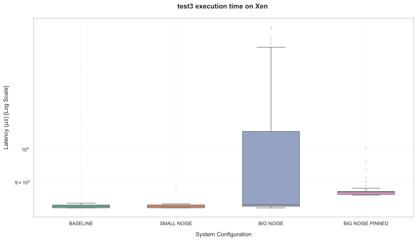

### TACLeBench with stress on Dom0

As previously mentioned, following the tests conducted, new studies have been added: the latter compares the temporal behavior (execution latency) of five benchmarks from the TACLe suite --- debie, huff_enc, lift, matrix1, test3 --- executed inside an HVM DomU on Xen, a Type 1 hypervisor, under two configurations of the low-latency Dom0 kernel ("LL", Linux 6.18.35-rt5-ll): without vCPU pinning and with pinning. The goal is to understand to what extent stress on Dom0 actually matters to the performance of a DomU, comparing it to the effects another noisy DomU had.

Data collection was automated with the provided bash script, which orchestrates the entire end-to-end experiment:

* **Dom0**: Xen 4.17-amd64 on Linux 6.18.35, 22 allocated vCPUs; kernel switching managed via grub-reboot across four variants (NRT, NRT-pinned, LL, LL-pinned).
* **DomU**: HVM Ubuntu 24.04 DomU, in two configuration variants --- unpinned and pinned --- corresponding to the type of Dom0 kernel under test.
* **Background workload ("always-on")**: `stress-ng --cpu 22` and `stress-ng --vm 12 --vm-bytes 2G`, started on Dom0 before each run and kept active for the entire duration of the scenario, to simulate a Dom0 under realistic pressure.
* **Sequential stressors** planned by the script: baseline (no additional stressor), cache, interrupts, rawsock --- launched one at a time alongside the background workload.
* **Automation**: creation/destruction of the DomU via xl, collection of log files from the DomU's virtual disk after shutdown, process and cache cleanup between runs.

**Methodological note**: the 10 provided files are execution time histograms of the TACLe benchmarks themselves (not of cyclictest, which is the workload shown in the script). The file names do not report which sequential stressor scenario was active during capture --- this is information to be retrieved in order to confidently attribute the observed differences solely to pinning and not to a mix of different conditions between the two runs.

#### Statistics extracted per file

| **Benchmark** | **Config** | **Min (µs)** | **Average (µs)** | **p99 (µs)** | **Max (µs)** | **Overflow** |
|---------------|------------|--------------|----------------|--------------|------------------|--------------|
| debie         | LL         | 30212.0      | 37133.0        | 46259.0      | 72372.0          | 0            |
| debie         | LL-pinned  | 23976.0      | 27275.0        | 29703.0      | 39230.0          | 0            |
| huff_enc      | LL         | 15.8         | 25.0           | 38.9         | 496.2            | 0            |
| huff_enc      | LL-pinned  | 15.9         | 16.5           | 26.7         | 1204.0           | 1            |
| lift          | LL         | 29.7         | 37.6           | 52.3         | 211.6            | 0            |
| lift          | LL-pinned  | 19.7         | 20.2           | 32.9         | 902.5            | 0            |
| matrix1       | LL         | 0.65         | 0.79           | 0.94         | 47.0             | 0            |
| matrix1       | LL-pinned  | 0.52         | 0.55           | 0.69         | 13.1             | 0            |
| test3         | LL         | 8322.0       | 9789.0         | 13279.0      | 17705.0          | 0            |
| test3         | LL-pinned  | 8228.0       | 8277.0         | 8335.0       | 16260.0          | 0            |


#### Results

The following graph summarizes, for each benchmark, the percentage variation of the mean, p99, and maximum when going from LL to LL-pinned (negative values = improvement).

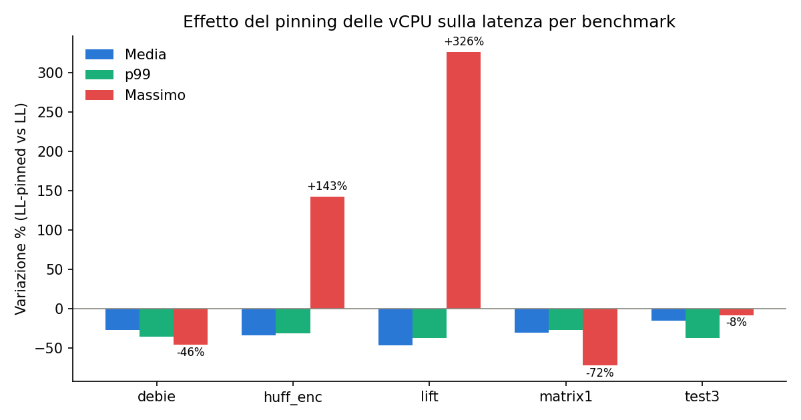

*Percentage variation of the mean, p99, and maximum (LL-pinned vs LL) for the five TACLe benchmarks: debie, huff_enc, lift, matrix1, test3.*

#### % Variation LL-pinned vs LL
| **Benchmark** | **Δ Average** | **Δ p99** | **Δ Max** |
|---------------|-------------|-----------|---------------|
| debie         | -26.5%      | -35.8%    | -45.8%        |
| huff_enc      | -34.1%      | -31.4%    | +142.6%       |
| lift          | -46.3%      | -37.0%    | +326.5%       |
| matrix1       | -30.7%      | -26.6%    | -72.1%        |
| test3         | -15.4%      | -37.2%    | -8.2%         |

#### 1- Pinning systematically improves typical latency

Across all five benchmarks, without exception, vCPU pinning reduces both the mean latency (from -15% to -46%) and the p99 (from -27% to -37%). This confirms the expected effect: fixing the DomU vCPUs to dedicated physical cores eliminates the variability introduced by the Dom0 scheduler and inter-core migrations, making the temporal behavior more predictable in the typical case.

#### 2- Tail anomaly: pinning worsening the worst case

On debie, matrix1, and test3, pinning also improves the worst-case (lower maximum). But on lift and huff_enc the opposite happens: the maximum latency increases drastically (+326% on lift, +143% on huff_enc), and huff_enc-pinned registers a histogram overflow, a sign that at least one sample exceeded even the maximum expected bucket --- the actual peak could therefore be even higher than reported.

This is the most significant result to document: pinning is not a unilateral guarantee of improvement. It reduces variance in the common case, but if the pinned core is not completely isolated from external interruptions (housekeeping IRQs, Dom0 timers, one of the stressors), when that rare interference occurs its impact is concentrated entirely on a single dedicated core instead of being distributed, producing an isolated spike much larger than what would happen with free scheduling.

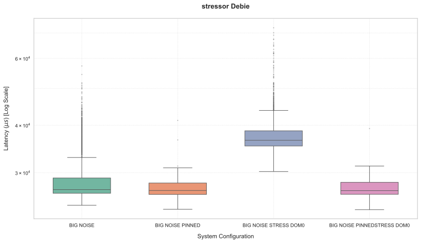

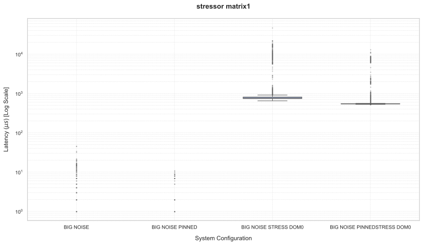

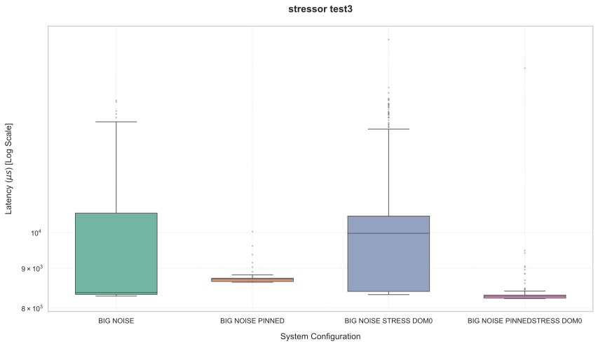

#### 3- Consistency between scale and behavior

The order of magnitude of latency varies greatly between benchmarks (from hundreds of nanoseconds for matrix1 to tens of milliseconds for debie), reflecting the different computational complexity of the TACLe workloads. The mean/p99 improvement pattern with pinning is maintained regardless of the scale, which reinforces the idea that it is a structural effect of pinning itself and not an artifact linked to the duration of the single benchmark.

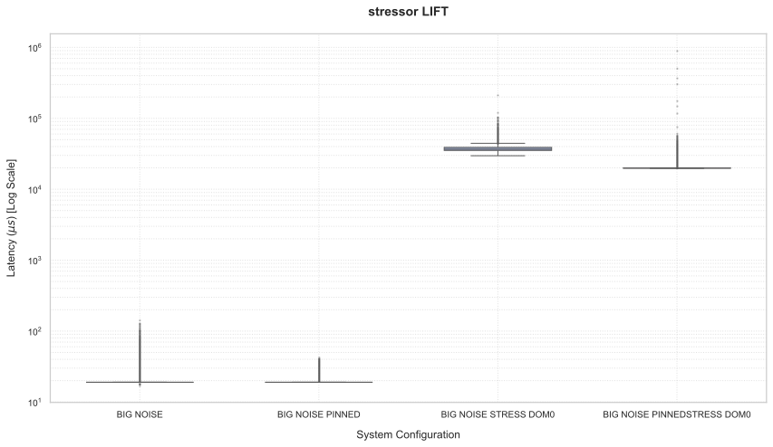

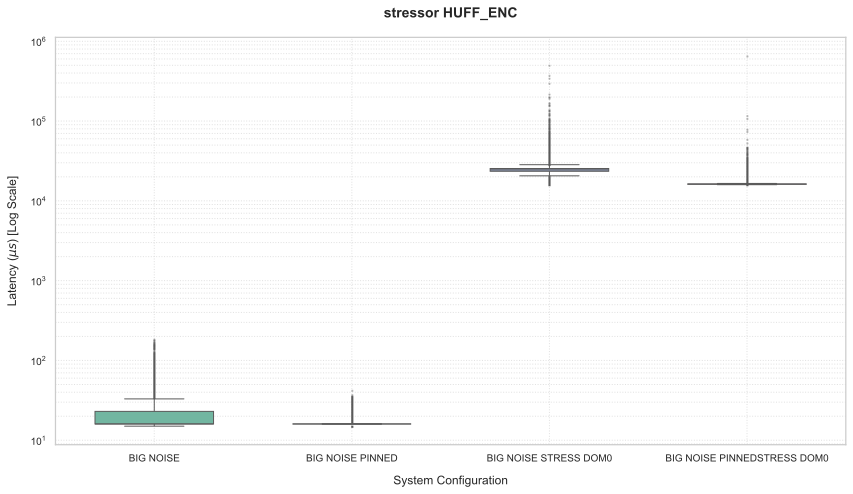

## PV AND PVH DOMUS

In their previous work, Abeni and Faggioli concluded that in Xen, virtualization technology played a major role in scheduling latencies due to a priority inversion bug in how the Device Model operated. Specifically, they noted that the QEMU process acting as the DomU DM did not execute with high priority, allowing it to be preempted by the workload.

We previously attempted to reproduce this issue using a newer version of Xen (4.17.3) but did not observe the same trend. We also tried assigning maximum priority to the QEMU process in Dom0, which yielded no noticeable improvement. Consequently, we concluded that this priority inversion bug has been fixed for HVM DomUs.

To further verify this conclusion, we extended our analysis to PV and PVH guests. In this section, we reproduce the most relevant scenarios for guests running on these different virtualization technologies and analyze their resulting behaviors.

### RT Kernel and PARAVIRTUALIZATION

While configuring the PV guest, we encountered the same issue observed during the [initial setup process](../Setup/README.md#problems-with-preempt_rt). This time, because the output logs were routed to the terminal, we were able to identify the cause. The logs revealed a **soft CPU lockup**, confirming that the issue stemmed from the `PREEMPT_RT` patch. We hypothesize that this failure relates to how the patch modifies low-level mechanisms—such as replacing spinlocks with mutexes—which introduces compatibility issues with paravirtualization. This also explains why the `PREEMPT_RT` patch failed in Dom0, as it is inherently a PV guest. Additionally, we attempted to configure Dom0 as a PVH guest; however, this setup resulted in continuous automatic reboots. Without access to system logs or graphical output to diagnose the root cause, we were unable to troubleshoot the error and ultimately abandoned this configuration. Consequently, for the subsequent tests, we replaced the RT kernel with the Low-Latency kernel in the DomU as well.

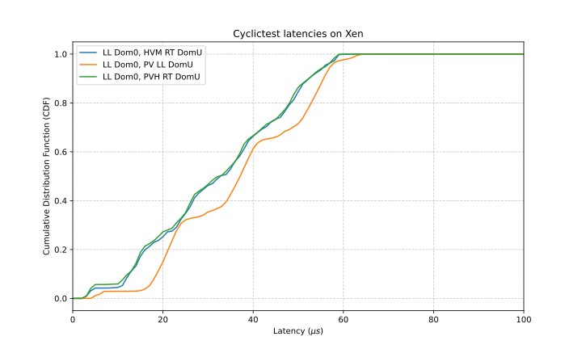

### LOW LATENCY DOM0 AND LOW LATENCY DOMU (PV DomU)

This section analyzes the results obtained from a 5-minute execution of the `cyclictest` utility within a Xen virtualized environment, explicitly assessing a Paravirtualized (PV) guest. The configuration features a "Low Latency" kernel deployed on both the privileged domain (Dom0) and the unprivileged user domain (DomU). This test evaluates the baseline performance of the dynamic scheduler without static vCPU pinning and without any artificial stress workload applied to Dom0.

#### Nominal Performance and Average Latency
The data obtained from the `cyclictest` execution reveals the baseline virtualization overhead and scheduling behavior in an undisturbed, unpinned PV configuration. The average latency recorded during the test was 37 µs, significantly higher than any other baseline average latency we recorded. The absolute minimum latency achieved was 4 µs.

#### Worst-Case Execution Time (WCET) Analysis
The analysis of the Worst-Case Execution Time (WCET) provides insight into the system's baseline ability to bound execution delays. Over the duration of the test, the absolute maximum latency recorded was 525 µs.

#### Observations on the Baseline PV Unpinned Environment
The empirical data collected from this test yields the following observations regarding the behavior of the Low Latency PV DomU running on a Low Latency Dom0 without vCPU pinning in a quiet environment:

*   **Bounded WCET:** The maximum latency was contained at 525 µs.
*   **Baseline Jitter:** The average latency of 37 µs confirms the presence of scheduling jitter.

### LOW LATENCY DOM0 AND REAL-TIME DOMU (PVH DomU)
 
This section analyzes the results obtained from a 5-minute execution of the `cyclictest` utility within a Xen virtualized environment, explicitly assessing a PVH guest. The configuration features a "Low Latency" kernel deployed on the privileged domain (Dom0) and a Real-Time (`PREEMPT_RT`) kernel on the unprivileged user domain (DomU). This test evaluates the baseline performance of the dynamic Credit2 scheduler without static vCPU pinning and without any artificial stress workload applied to Dom0.
 
#### Nominal Performance and Average Latency
The data obtained from the `cyclictest` execution reveals the baseline virtualization overhead and scheduling behavior in an undisturbed, unpinned configuration. The average latency recorded during the test was 32 µs. The absolute minimum latency achieved was 3 µs. The histogram data indicates a broad distribution of execution latencies, demonstrating the variability introduced by dynamic scheduling even in the absence of host-level contention.
 
#### Worst-Case Execution Time (WCET) Analysis
The analysis of the Worst-Case Execution Time (WCET) provides insight into the system's baseline ability to bound execution delays. Over the duration of the test, the absolute maximum latency recorded was 76 µs. The system successfully avoided any histogram overflows.
 
#### Observations on the Baseline PVH Unpinned Environment
The empirical data collected from this test yields the following observations regarding the behavior of the RT PVH DomU running on a Low Latency Dom0 without vCPU pinning in a quiet environment:
 
*   **Bounded WCET:** The maximum latency was contained at 76 µs, indicating that the combination of the RT guest kernel and the Low Latency host kernel provides a stable upper bound when the host is not under load.
*   **Baseline Jitter:** The average latency of 32 µs and the wide spread of nominal execution times confirm the presence of significant scheduling jitter. This variability highlights the inherent impact of the dynamic Credit2 hypervisor scheduler, even without resource contention from a `stressdom0` workload.

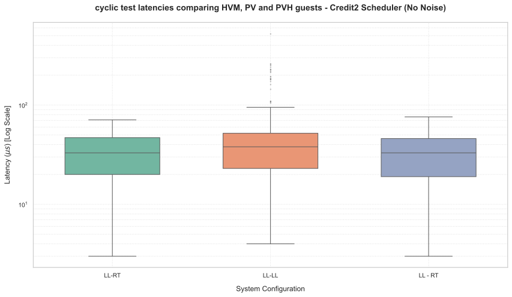

## IMPACT OF THE STRESS WORKLOAD ON DIFFERENT VIRTUALIZATION TECHNOLOGIES

To assess the influence of the underlying virtualization architecture on system determinism, this phase of testing introduces a background stress workload in the privileged domain (Dom0) while executing the `cyclictest` probe within PV and PVH guests. Building upon our earlier findings—which demonstrated that modern Hardware Virtual Machine (HVM) configurations successfully manage latency bounds without suffering from historical QEMU-induced preemption anomalies—this evaluation aims to compare how alternative virtualization models respond to resource contention. Ultimately, the analysis highlights that while PVH and HVM achieve highly similar performance levels, the PV architecture exhibits the worst performance among all three technologies.

Experimental analysis reveals that moving away from full hardware virtualization fundamentally alters the system dynamics, highlighting key architectural trade-offs when employing PV and PVH configurations:

* **Absence of the Device Model:** Unlike HVM guests, PV and PVH architectures do not rely on a QEMU instance running in Dom0 for hardware emulation. While our previous tests confirmed that modern Xen deployments resolve the historical priority inversion bugs associated with QEMU, evaluating PV and PVH guests allows us to observe system behavior completely isolated from Device Model interactions.
* **Constraints on Kernel Optimization:** While paravirtualization removes the Device Model variable, it introduces strict constraints regarding real-time optimizations. As established during the initial setup, the inherent incompatibility of the `PREEMPT_RT` patch with PV guests necessitated a fallback to a Low Latency kernel. This dynamic fundamentally shifts the performance bottleneck from hypervisor-level interference to guest-level scheduling limitations, severely penalizing the PV configuration.
* **Comparative Resilience to Contention:** Evaluating these paravirtualized environments under Dom0 stress provides a direct contrast to the HVM data. The empirical results reveal that the intrinsically lighter virtualization footprint of the PV architecture cannot compensate for the lack of rigorous, real-time guest optimizations, resulting in the poorest latency bounds. Conversely, the PVH architecture overcomes these limitations, demonstrating a resilience to contention and overall performance metrics that are remarkably similar to those of HVM.

In this section, we present a detailed comparative analysis of these configurations, quantifying the execution latencies of PV and PVH guests under stress to determine their overall viability for predictable, latency-sensitive applications compared to their HVM counterparts.

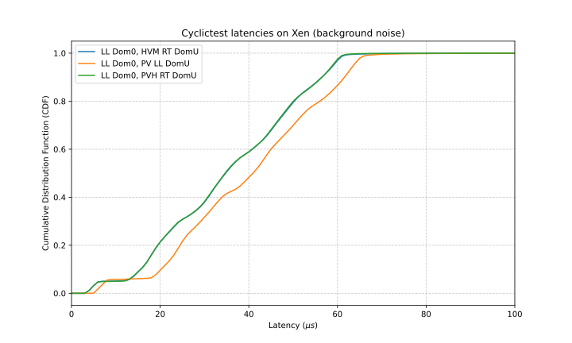

### LOW LATENCY DOM0 AND LOW LATENCY DOMU (PV DomU)

This section details the analysis of a 5-minute execution of the `cyclictest` utility within a Xen virtualized environment, specifically evaluating a Paravirtualized (PV) guest. This configuration features a "Low Latency" kernel deployed on both the privileged domain (Dom0) and the unprivileged user domain (DomU). Crucially, this test was conducted without static vCPU pinning and while Dom0 was subjected to a significant background stress workload (`stressdom0`). The objective is to evaluate the latency characteristics and the impact of host-level contention when both domains utilize low-latency optimizations in an unpinned PV environment.

#### Nominal Performance and Average Latency
The data obtained from the `cyclictest` execution reveals the baseline virtualization overhead and scheduling jitter under stress conditions. The average latency recorded during the test was 40 µs. The absolute minimum latency achieved was 4 µs. The histogram data indicates a broad distribution of execution latencies, demonstrating the variability introduced by the dynamic Credit2 scheduler when managing host-level contention without vCPU pinning.

#### Worst-Case Execution Time (WCET) Analysis
The analysis of the Worst-Case Execution Time (WCET) provides insight into the system's ability to bound execution delays under stress. Over the duration of the test, the absolute maximum latency recorded was 312 µs.

#### Observations on the Stressed PV Unpinned Environment
The empirical data collected from this sustained test yields the following observations regarding the behavior of the Low Latency PV DomU running on a Low Latency Dom0 without vCPU pinning under `stressdom0`:

*   **Bounded WCET:** The maximum latency was contained at 312 µs, indicating that the dual Low-Latency kernel setup provides a degree of stability under stress, preventing extreme multi-millisecond spikes despite the lack of pinning.
*   **Stress-Induced Jitter:** The average latency of 40 µs and the wide spread of nominal execution times confirm the presence of significant scheduling jitter. This highlights the impact of dynamic hypervisor scheduling and resource contention from the `stressdom0` workload on a PV guest.

### LOW LATENCY DOM0 AND REAL-TIME DOMU (PVH DomU)
 
This section details the analysis of a 5-minute execution of the `cyclictest` utility within a Xen virtualized environment, explicitly assessing a PVH guest. The configuration features a "Low Latency" kernel deployed on the privileged domain (Dom0) and a Real-Time (`PREEMPT_RT`) kernel on the unprivileged user domain (DomU). Crucially, this test was conducted without static vCPU pinning and while Dom0 was subjected to a significant background stress workload. The objective is to evaluate the latency characteristics and virtualization overhead introduced by the hypervisor when managing a PVH guest under these specific, unpinned stress conditions.
 
#### Nominal Performance and Average Latency
The data obtained from the `cyclictest` execution reveals the baseline virtualization overhead and scheduling jitter inherent in this unpinned configuration. The average latency recorded during the test was 35 µs. The absolute minimum latency achieved was 3 µs. The histogram data indicates a broad distribution of execution latencies, demonstrating the variability introduced when dynamic scheduling is utilized under host-level contention.
 
#### Worst-Case Execution Time (WCET) Analysis
The analysis of the Worst-Case Execution Time (WCET) provides insight into the system's ability to bound execution delays under stress. Over the duration of the test, the absolute maximum latency recorded was 157 µs.
 
#### Observations on the PVH Unpinned Environment
The empirical data collected from this sustained test yields the following observations regarding the behavior of the RT PVH DomU running on a Low Latency Dom0 without vCPU pinning:
 
*   **Bounded WCET:** The maximum latency was contained at 157 µs, indicating that the combination of the RT guest kernel and the Low Latency host kernel provided a degree of stability, preventing the extreme, multi-millisecond spikes that can occur in less optimized configurations.
*   **Hypervisor-Induced Jitter:** The average latency of 35 µs and the wide spread of nominal execution times confirm the presence of significant scheduling jitter. This variability highlights the impact of dynamic hypervisor scheduling and resource contention from the `stressdom0` workload when vCPUs are not statically pinned to dedicated physical cores.

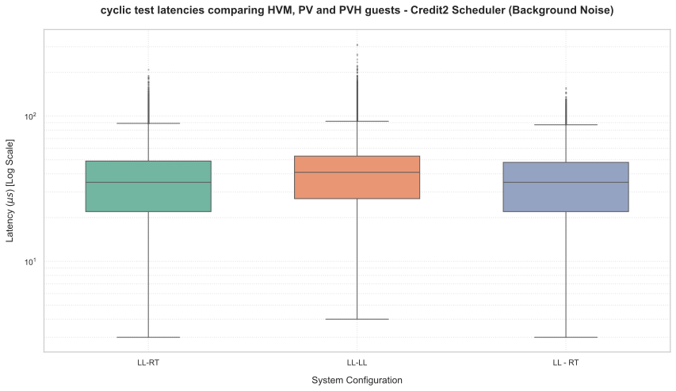

## COMPARATIVE ANALYSIS OF PV AND PVH ARCHITECTURES UNDER STATIC ALLOCATION

Following the initial investigations into dynamic scheduling behavior, this section presents a targeted comparative analysis of execution latencies between Paravirtualized (PV) and Hardware Virtual Machine with PV drivers (PVH) configurations. To eliminate the jitter introduced by complex fair-share algorithms and evaluate the highest degree of determinism achievable, these tests employ strict vCPU-to-pCPU pinning across both the privileged domain (Dom0) and the unprivileged user domain (DomU), effectively emulating the deterministic behavior of an offline NULL scheduler.

The evaluation is conducted under ideal, unstressed conditions, isolating the system from external background workloads. By analyzing both PV and PVH DomU architectures in a quiet environment, we establish a clean baseline for the inherent virtualization overhead that persists even when static hardware allocation is employed. 

This comparative approach aims to quantify the efficacy of strict hardware isolation in bounding the Worst-Case Execution Time (WCET). By observing the system's baseline predictability, the analysis highlights the specific architectural nuances between PV and PVH environments, demonstrating how effectively vCPU pinning manages nominal execution latencies prior to the introduction of external stress factors.

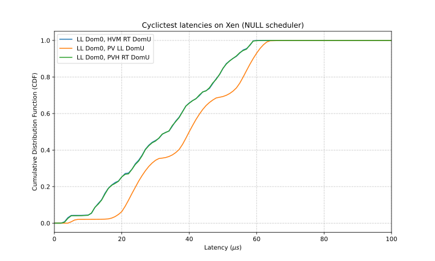


### LOW LATENCY DOM0 AND LOW LATENCY DOMU (PV DomU)

This section details the analysis of a 5-minute execution of the `cyclictest` utility within a Xen virtualized environment, specifically evaluating a Paravirtualized (PV) guest. The configuration utilizes a "Low Latency" kernel for both the privileged domain (Dom0) and the unprivileged user domain (DomU). Crucially, this test evaluates the system emulating the static NULL scheduler with explicit vCPU pinning, and it is conducted in a quiet environment without any background `stressdom0` workload. The objective is to assess the baseline latency and determinism of a PV guest when fully optimized through static hardware allocation.

#### Nominal Performance and Average Latency
The data obtained from the `cyclictest` execution reveals the baseline virtualization overhead in this optimized, pinned PV configuration. The average latency recorded during the test was 39 µs. The absolute minimum latency achieved was 5 µs. While pinning isolates the workload, the histogram indicates a spread in nominal execution times, confirming that baseline virtualization jitter persists even with a static scheduler.

#### Worst-Case Execution Time (WCET) Analysis
The analysis of the Worst-Case Execution Time (WCET) highlights the system's ability to bound execution delays under ideal, unstressed conditions. Over the duration of the test, the absolute maximum latency recorded was 492 µs.

#### Observations on the Baseline PV Pinned Environment (NULL Scheduler)
The empirical data collected from this sustained test yields the following observations regarding the behavior of the Low Latency PV DomU running on a Low Latency Dom0 with static pinning using the NULL scheduler:

*   **Bounded WCET:** The maximum latency was contained at 492 µs. While higher than fully patched RT configurations, this demonstrates a stable upper bound for a PV guest utilizing Low Latency kernels in a pinned environment.
*   **Baseline Jitter:** The average latency of 39 µs indicates that the static allocation provided by the NULL scheduler does not completely eliminate the inherent scheduling jitter associated with the virtualization layer itself.

### LOW LATENCY DOM0 AND REAL TIME DOMU (PVH DomU)

This section details the analysis of a 5-minute execution of the `cyclictest` utility within a Xen virtualized environment, specifically evaluating a PVH guest. The configuration utilizes a "Low Latency" kernel deployed on the privileged domain (Dom0) and a Real-Time (`PREEMPT_RT`) kernel on the unprivileged user domain (DomU). This test evaluates the system emulating the static NULL scheduler with explicit vCPU pinning, and it is conducted in a quiet environment without any background stress workload. The objective is to assess the baseline latency and determinism of a highly optimized PVH guest when fully isolated through static hardware allocation.

#### Nominal Performance and Average Latency
The data obtained from the `cyclictest` execution reveals the baseline virtualization overhead in this optimized, pinned PVH configuration. The average latency recorded during the test was 33 µs. The absolute minimum latency achieved was 3 µs. The histogram indicates a tight distribution of nominal execution times, confirming that pinning effectively shields the guest and provides high consistency.

#### Worst-Case Execution Time (WCET) Analysis
The analysis of the Worst-Case Execution Time (WCET) highlights the system's ability to rigidly bound execution delays under ideal, unstressed conditions. Over the duration of the test, the absolute maximum latency recorded was 71 µs.

#### Observations on the Baseline PVH Pinned Environment (NULL Scheduler)
The empirical data collected from this sustained test yields the following observations regarding the behavior of the RT PVH DomU running on a Low Latency Dom0 with static pinning using the NULL scheduler:

*   **Strictly Bounded WCET:** The maximum latency was contained at 71 µs. This demonstrates an exceptionally stable upper bound for a PVH guest, proving that the combination of RT guest kernels, Low Latency host kernels, vCPU pinning, and the NULL scheduler provides hard real-time characteristics.
*   **Baseline Jitter:** The average latency of 33 µs and the tight spread of execution times indicate a high level of consistency in the static allocation provided by the NULL scheduler.

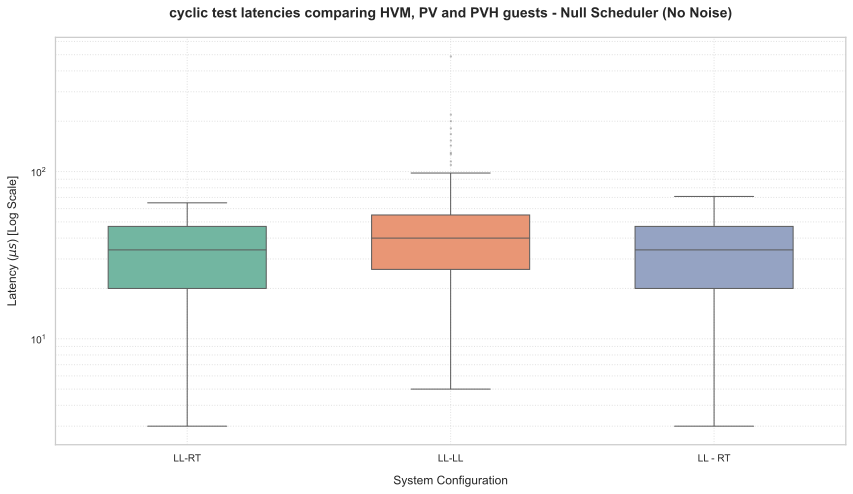

## IMPACT OF THE STRESS WORKLOAD ON PV AND PVH ARCHITECTURES UNDER STATIC ALLOCATION

Building upon the baseline established in the ideal, unstressed environment, this phase introduces a severe background stress workload (`stressdom0`) into the privileged control domain. The primary objective is to evaluate the resilience of static vCPU pinning—acting as a surrogate for the offline NULL scheduler—when the host system is heavily saturated with competing processes.

By subjecting both the Paravirtualized (PV) and Hardware Virtual Machine with PV drivers (PVH) guests to this intense host-level contention, we can determine whether strict hardware isolation alone is sufficient to prevent latency spikes from degrading guest determinism. This evaluation specifically tests the boundaries of system predictability, observing the extent to which stress-induced jitter manages to bypass the static allocation and affect the isolated virtual CPUs.

The subsequent analyses reveal a distinct divergence in architectural resilience under load. While vCPU pinning provides a foundational level of stability for both configurations, the empirical data highlights that the PV architecture remains susceptible to measurable interference from the host. Conversely, the PVH architecture demonstrates exceptional isolation, successfully shielding its critical execution paths and maintaining rigid Worst-Case Execution Time (WCET) boundaries despite the intense resource contention within Dom0.

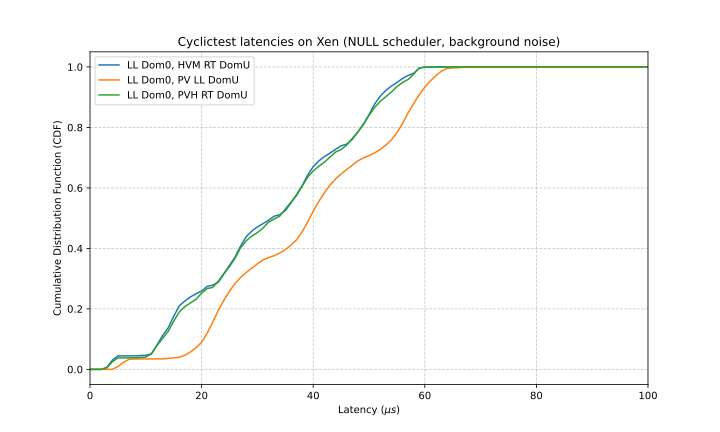

### LOW LATENCY DOM0 AND LOW LATENCY DOMU (PV DomU)

This section analyzes the results obtained from a 5-minute execution of the `cyclictest` utility within a Xen virtualized environment, explicitly assessing a Paravirtualized (PV) guest. The configuration features a "Low Latency" kernel deployed on both the privileged domain (Dom0) and the unprivileged user domain (DomU). Crucially, this test evaluates the performance of the NULL scheduler with explicit vCPU pinning while Dom0 is subjected to a significant background stress workload (`stressdom0`). The objective is to evaluate the latency characteristics and the ability of the NULL scheduler's static allocation to manage host-level contention in an optimized, pinned PV environment.

#### Nominal Performance and Average Latency
The data obtained from the `cyclictest` execution reveals the baseline virtualization overhead and scheduling behavior under stress conditions when utilizing the static NULL scheduler with pinning. The average latency recorded during the test was 39 µs. The absolute minimum latency achieved was 4 µs. The histogram data indicates a broad distribution of execution latencies, demonstrating the variability introduced by the `stressdom0` workload, even when a static, pinned scheduler is employed.

#### Worst-Case Execution Time (WCET) Analysis
The analysis of the Worst-Case Execution Time (WCET) provides insight into the system's ability to bound execution delays under stress. Over the duration of the test, the absolute maximum latency recorded was 285 µs. 

#### Observations on the Stressed PV Pinned Environment (NULL Scheduler)
The empirical data collected from this sustained test yields the following observations regarding the behavior of the Low Latency PV DomU running on a Low Latency Dom0 with vCPU pinning under `stressdom0` using the NULL scheduler:

*   **Bounded WCET:** The maximum latency was contained at 285 µs. This indicates that the combination of the dual Low-Latency kernel setup and the pinned NULL scheduler provides a degree of stability under stress, establishing a tighter bound than unpinned configurations.
*   **Stress-Induced Jitter:** The average latency of 39 µs and the wide spread of nominal execution times confirm the presence of significant scheduling jitter. This highlights that even with a statically pinned scheduler, resource contention from the `stressdom0` workload on a PV guest still significantly impacts latency stability.

### LOW LATENCY DOM0 AND REAL-TIME DOMU (PVH DomU)

This section analyzes the results obtained from a 5-minute execution of the `cyclictest` utility within a Xen virtualized environment, evaluating a Hardware Virtual Machine with Paravirtualized drivers (PVH) guest. The configuration features a "Low Latency" kernel deployed on the privileged domain (Dom0) and a Real-Time (`PREEMPT_RT`) kernel on the unprivileged user domain (DomU). Crucially, this test evaluates the performance of the NULL scheduler with explicit vCPU pinning while Dom0 is subjected to a background stress workload (`stressdom0`). The objective is to evaluate the latency characteristics and the ability of the NULL scheduler's static allocation to maintain determinism under host-level contention in an optimized, pinned PVH environment.

#### Nominal Performance and Average Latency
The data obtained from the `cyclictest` execution reveals the baseline virtualization overhead and scheduling behavior under stress conditions when utilizing the static NULL scheduler with vCPU pinning. The average latency recorded during the test was 33 µs. The absolute minimum latency achieved was 3 µs. The data indicates a concentrated distribution of nominal execution times, demonstrating a high level of consistency despite the background load.

#### Worst-Case Execution Time (WCET) Analysis
The analysis of the Worst-Case Execution Time (WCET) provides insight into the system's ability to rigidly bound execution delays under stress. Over the duration of the test, the absolute maximum latency recorded was strictly capped at 71 µs.

#### Observations on the Stressed PVH Pinned Environment (NULL Scheduler)
The empirical data collected from this sustained test yields the following observations regarding the behavior of the RT PVH DomU running on a Low Latency Dom0 with vCPU pinning under `stressdom0` using the NULL scheduler:

*   **Strictly Bounded WCET:** The maximum latency was contained at 71 µs. This demonstrates that the combination of the `PREEMPT_RT` guest kernel, the Low-Latency host kernel, static vCPU pinning, and the NULL scheduler provides exceptional stability and successfully shields the critical guest execution path from severe preemption spikes.
*   **Resilience to Host Stress:** The average latency of 33 µs and the rigid WCET boundary confirm that this highly optimized, static PVH configuration effectively mitigates the severe scheduling jitter typically induced by host-level resource contention.


## SUMMARY OF RESULTS (PV AND PVH)

To synthesize the findings from our latency evaluations, the following table aggregates the Worst-Case Execution Time (WCET) results recorded across the three evaluated Xen virtualization modes: Hardware Virtual Machine (HVM), Hardware Virtual Machine with Paravirtualized drivers (PVH), and fully Paravirtualized (PV) guests. 


| Configuration | HVM | PVH | PV | 
|---|---|---|---|
| **BASELINE** | 71 | 76 | 525 | 
| **STRESS WORKLOAD** | 209 | 157 | 312 | 
| **vCPU PINNING BASELINE** | 65 | 71 | 492 |
| **vCPU PINNING STRESS WORKLOAD** | 163 | 71 | 285 |

This section provides a quantitative breakdown of the percentage increments for both the average latency (Average ± Standard Deviation) and the maximum latency (WCET) across Xen's three virtualization modes: HVM, PV, and PVH. The analysis evaluates the performance degradation caused by a heavy stress workload introduced in the control domain (Dom0).

The following tables illustrate the system's behavior under the default dynamic scheduler. These results highlight the performance impact of the Dom0 stress workload when no hardware isolation mechanisms are applied.
### HVM LL RT

| METRIC | BASELINE | STRESS WORKLOAD |
| :--- | :--- | :--- |
| **Average ± SD** | 32.89 ± 15.14 µs | 35.66 ± 15.60 µs |
| **WCET (Max)** | 71 µs | 209 µs |

**PERCENTAGE INCREMENTS (Stress vs. Baseline):**
* Average Increment: +8.42%
* WCET Increment: +194.37%


### PV LL-LL

| METRIC | BASELINE | STRESS WORKLOAD |
| :--- | :--- | :--- |
| **Average ± SD** | 37.17 ± 14.69 µs | 40.20 ± 16.22 µs |
| **WCET (Max)** | 525 µs | 312 µs |

**PERCENTAGE INCREMENTS (Stress vs. Baseline):**
* Average Increment: +8.16%
* WCET Increment: -40.57%


### PVH LL-RT

| METRIC | BASELINE | STRESS WORKLOAD |
| :--- | :--- | :--- |
| **Average ± SD** | 32.40 ± 15.36 µs | 35.58 ± 15.50 µs |
| **WCET (Max)** | 76 µs | 157 µs |

**PERCENTAGE INCREMENTS (Stress vs. Baseline):**
* Average Increment: +9.82%
* WCET Increment: +106.58%

---
The tables below evaluate the resilience of the same configurations when strict vCPU pinning is enforced. By isolating Dom0 and DomU on dedicated physical cores, this scenario demonstrates how static hardware allocation mitigates scheduling interference under stress.

### HVM LL RT

| METRIC | vCPU PINNING BASELINE | vCPU PINNING STRESS WORKLOAD |
| :--- | :--- | :--- |
| **Average ± SD** | 33.09 ± 15.18 µs | 32.73 ± 15.09 µs |
| **WCET (Max)** | 65 µs | 163 µs |

**PERCENTAGE INCREMENTS (Stress vs. Baseline):**
* Average Increment: -1.11%
* WCET Increment: +150.77%


### PV LL-LL (Static vCPU Pinning)

| METRIC | vCPU PINNING BASELINE | vCPU PINNING STRESS WORKLOAD |
| :--- | :--- | :--- |
| **Average ± SD** | 40.00 ± 14.71 µs | 39.15 ± 15.23 µs |
| **WCET (Max)** | 492 µs | 285 µs |

**PERCENTAGE INCREMENTS (Stress vs. Baseline):**
* Average Increment: -2.13%
* WCET Increment: -42.07%


### PVH LL-RT (Static vCPU Pinning)

| METRIC | vCPU PINNING BASELINE | vCPU PINNING STRESS WORKLOAD |
| :--- | :--- | :--- |
| **Average ± SD** | 33.16 ± 15.12 µs | 33.20 ± 15.09 µs |
| **WCET (Max)** | 71 µs | 71 µs |

**PERCENTAGE INCREMENTS (Stress vs. Baseline):**
* Average Increment: +0.14%
* WCET Increment: 0.00%


